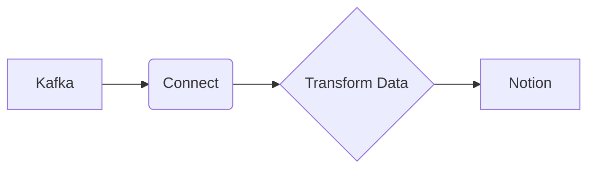

# Connect Kafka to Notion

Quix helps you integrate Kafka to Notion using pure Python.

## Notion

Notion is a versatile and powerful productivity tool that combines note-taking, project management, database creation, and more all in one platform. Users can store all their information, ideas, and tasks in one place, streamlining their workflow and increasing efficiency. Notion allows for easy collaboration with team members, with the ability to share pages and work together in real-time. The platform is highly customizable, allowing users to create their own templates, databases, and workflows to suit their specific needs. Notion is available on desktop and mobile devices, making it accessible and convenient for users on the go. With its user-friendly interface and wide range of features, Notion is a valuable tool for individuals and teams looking to better organize and manage their work.

## Integrations

Notion is a popular tool for note-taking, project management, and collaboration, with the ability to create databases, wikis, and tasks within a unified platform. By integrating Quix with Notion, users can enhance their data processing and visualization capabilities within the context of their existing workflows.

Quix Streams, with its cloud-native library for processing data in Kafka using Python, can seamlessly interact with Notion to ingest, process, and analyze real-time data streams. The library's Python interface can integrate well with the Python ecosystem within Notion, allowing users to leverage libraries like Pandas, scikit-learn, TensorFlow, and PyTorch for advanced data processing and machine learning tasks.

Additionally, Quix Streams' support for serialization formats, time window aggregations, and resilient scaling make it well-suited for handling complex data pipelines and real-time data processing within Notion. Users can benefit from the platform's ability to scale via container orchestration and its support for local development and debugging through Jupyter Notebook.

On the other hand, Quix Cloud offers a comprehensive platform for developing, deploying, and managing real-time data pipelines, providing features for streamlined development, enhanced collaboration, real-time monitoring, and flexible scaling. By integrating Quix Cloud with Notion, users can streamline their data pipeline development processes, enhance collaboration among team members, and monitor pipeline performance in real-time.

Furthermore, Quix Cloud's support for security and compliance, integration with Git providers, and dedicated infrastructure options align well with Notion's requirements for secure and efficient data management. The platform's data exploration and visualization capabilities can complement Notion's features for creating databases and visualizing data, enabling users to gain valuable insights from their data within the Notion platform.

Overall, integrating Quix with Notion can provide users with a powerful solution for managing and analyzing real-time data within their existing workflows, enhancing collaboration, and driving informed decision-making.

