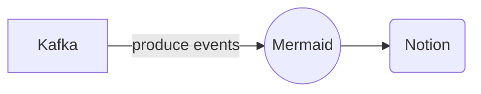

# Connect Kafka to Notion

Quix helps you integrate Kafka to Notion using pure Python.

- __Find out how we can help you integrate!__

    <a class="md-button md-button--primary" href="https://share.hsforms.com/1iW0TmZzKQMChk0lxd_tGiw4yjw2?__hstc=175542013.2303933fbd746c0ac86d9ccbe9bc9100.1728383268831.1729603416735.1729620918855.31&__hssc=175542013.1.1729620918855&__hsfp=2132701734" target="_blank" style="margin:.5rem;">Book a demo</a>

## Notion

Notion is a powerful all-in-one workspace app that allows users to manage tasks, track projects, collaborate with teams, and organize information in one place. With its customizable interface and versatile features, Notion can be tailored to suit individual preferences and work styles. Users can create databases, tables, boards, and calendars to streamline their workflow and keep everything organized. Notion also offers seamless integration with other tools and platforms, making it easy to sync data and collaborate with others. Overall, Notion is a versatile and efficient technology that simplifies work processes and enhances productivity for individuals and teams alike.

## Integrations

Quix is a good fit for integrating with Notion because it offers a comprehensive platform for developing, deploying, and managing real-time data pipelines, which aligns well with Notion's capabilities and features. 

1. Streamlined Development and Deployment: Quix's integrated online code editors and CI/CD tools simplify the creation and deployment of data pipelines, making it easier for users to streamline their development process. This aligns with Notion's aim to provide a seamless and user-friendly experience for its users.

2. Enhanced Collaboration: Quix Cloud supports efficient collaboration with organization and permission management, increasing project visibility and control. This complements Notion's emphasis on improving collaboration and teamwork among its users.

3. Real-Time Monitoring: Quix Cloud provides tools for real-time logs, metrics, and data exploration, allowing users to monitor pipeline performance and critical metrics. This real-time monitoring capability is valuable for users of Notion who require up-to-date information and insights.

4. Flexible Scaling and Management: Users can easily scale resources, manage CPU and memory, and handle multiple environments linked to Git branches with Quix. This flexibility aligns with Notion's focus on providing users with customizable and scalable solutions for their needs.

5. Security and Compliance: Quix ensures secure management of secrets and compliance with dedicated infrastructure options and SLAs, which is crucial for users who prioritize security and compliance. This feature aligns with Notion's commitment to protecting user data.

In addition, Quix Streams, a cloud-native library for processing data in Kafka using Python, offers benefits such as Python ecosystem integration, serialization and state management, time window aggregations, resilient scaling, and local and Jupyter Notebook support. These features make it a versatile and efficient tool for integrating with Notion's technology stack, providing users with additional functionalities and capabilities for their data processing needs.

