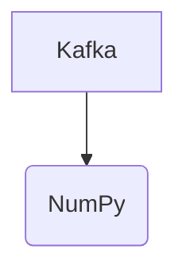

# Connect Kafka to NumPy

Quix helps you integrate Kafka to NumPy using pure Python.

<a class="md-button md-button--primary" href="https://share.hsforms.com/1iW0TmZzKQMChk0lxd_tGiw4yjw2?__hstc=175542013.2303933fbd746c0ac86d9ccbe9bc9100.1728383268831.1729603416735.1729620918855.31&__hssc=175542013.1.1729620918855&__hsfp=2132701734" target="_blank" style="margin-right:.5rem;">Book a demo</a>
 

## NumPy

NumPy is a powerful Python library that is primarily used for numerical computations and data analysis. It provides support for multidimensional arrays and matrices, along with a variety of mathematical functions to operate on these arrays. NumPy is known for its efficiency and speed, making it ideal for handling large datasets and performing complex computations. It is widely used in fields such as machine learning, scientific computing, and data science, due to its versatility and robustness. Overall, NumPy is a valuable tool for anyone working with numbers and data in Python.

## Integrations

Quix is a good fit for integrating with NumPy because both technologies are focused on data processing and manipulation. NumPy is a popular library for numerical computing in Python, providing support for large arrays and matrices, along with a collection of mathematical functions to operate on these arrays.

Quix's streamlined development and deployment features, along with its support for collaboration and real-time monitoring, make it a powerful platform for building and managing data pipelines. By integrating with NumPy, Quix can leverage the capabilities of NumPy for efficient data processing and analysis within its real-time pipelines.

Using NumPy within Quix Streams, users can benefit from the seamless integration with Python ecosystem libraries like Pandas, providing additional tools for data manipulation and analysis. The serialization and state management support in Quix Streams align well with NumPy's capabilities for handling large datasets efficiently.

Furthermore, the resilience and scaling features of Quix Streams, designed to work seamlessly with container orchestration technologies like Kubernetes, complement NumPy's ability to handle complex computations on distributed systems.

In conclusion, integrating Quix with NumPy enables users to take advantage of both technologies' strengths, providing a comprehensive solution for developing, deploying, and managing real-time data pipelines with advanced data processing capabilities.

