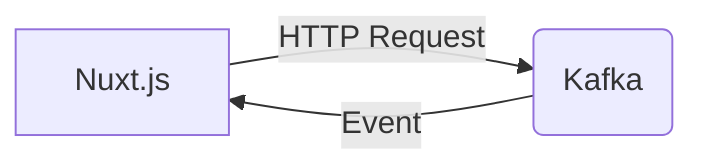

# Connect Kafka to Nuxt.js

Quix helps you integrate Kafka to Nuxt.js using pure Python.

## Nuxt.js

Nuxt.js is a powerful framework for building Vue.js applications. It is known for its ease of use and efficiency in creating fast, interactive web applications. Nuxt.js provides a variety of features, such as server-side rendering, client-side rendering, and static site generation, making it a versatile tool for developers. With its robust ecosystem of modules and plugins, Nuxt.js allows developers to easily extend and customize their applications. Overall, Nuxt.js is a valuable technology that simplifies the development process and produces high-quality web applications.

## Integrations

Nuxt.js is a popular framework for building universal Vue.js applications. It provides developers with a powerful set of tools for creating fast and interactive user interfaces. When integrating Nuxt.js with Quix, there are several reasons why they are a good fit:

1. Streamlined Development and Deployment: Quix Cloud's integrated online code editors and CI/CD tools can simplify the process of building and deploying Nuxt.js applications. Developers can quickly write and test code, and seamlessly deploy their applications with the platform's streamlined development and deployment capabilities.

2. Real-Time Monitoring: Quix Cloud's real-time monitoring tools can be beneficial for Nuxt.js applications, allowing developers to track performance metrics and troubleshoot issues in real-time. This can help ensure that Nuxt.js applications are running smoothly and efficiently.

3. Flexible Scaling and Management: Quix Cloud offers flexible scaling and management options, allowing developers to easily scale resources and manage CPU and memory usage for Nuxt.js applications. This can help ensure that applications are able to handle increased traffic and workload as needed.

4. Security and Compliance: Quix Cloud's secure management of secrets and compliance features can provide peace of mind for developers working with sensitive data in Nuxt.js applications. The platform's dedicated infrastructure options and SLAs can help ensure that applications meet necessary security and compliance requirements.

5. Integration with Kafka: Quix Streams' integration with Kafka can be particularly beneficial for Nuxt.js applications that rely on real-time data processing. Developers can leverage Quix Streams' cloud-native library for processing data in Kafka using Python to enhance the performance and scalability of their Nuxt.js applications.

Overall, integrating Nuxt.js with Quix can provide developers with a comprehensive platform for building, deploying, and managing real-time data pipelines. The combination of Nuxt.js's powerful frontend capabilities and Quix's robust backend features can help developers create high-performance and scalable applications.

