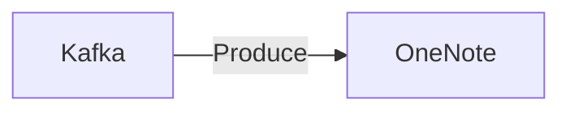

# Connect Kafka to OneNote

Quix helps you integrate Kafka to OneNote using pure Python.

## OneNote

OneNote is a digital note-taking application developed by Microsoft that allows users to easily create, organize, and collaborate on notes and documents. The technology enables users to create notebooks, sections, and pages to organize their thoughts, ideas, and information in a structured way. OneNote also supports a variety of multimedia elements such as images, audio recordings, and links, making it a versatile tool for capturing and sharing information. With its cloud-based storage and synchronization capabilities, users can access their notes from any device and collaborate with others in real-time. Overall, OneNote provides a convenient and efficient platform for managing and sharing information in a digital format.

## Integrations

Quix would be a good fit for integrating with OneNote because of its support for real-time data processing and flexibility in data management. OneNote is a platform widely used for note-taking, data organization, and collaboration, making it crucial for users to have real-time access to their data. With Quix Streams' ability to process data in real time and Quix Cloud's features such as real-time monitoring and scaling capabilities, users can seamlessly integrate their OneNote data with these platforms for efficient data processing and management.

Additionally, Quix Streams' Python interface and integration with Python libraries like Pandas, scikit-learn, TensorFlow, and PyTorch make it easier for users to work with their data in a familiar environment. This compatibility with the Python ecosystem can streamline the integration process and enable users to leverage existing tools and workflows when working with their OneNote data.

Furthermore, Quix Streams' support for time window aggregations, resilience scaling, and local and Jupyter Notebook support can enhance the development and debugging process when integrating OneNote data with the platform. Overall, the comprehensive features of Quix Streams and Quix Cloud make them ideal choices for integrating with OneNote and optimizing data processing and management workflows.

