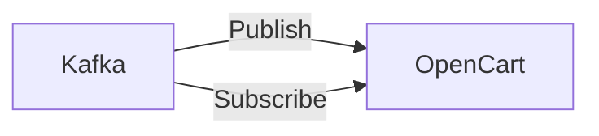

# Connect Kafka to OpenCart

Quix helps you integrate Kafka to OpenCart using pure Python.

## OpenCart

OpenCart is an open-source e-commerce platform that allows users to create and manage online stores with ease. It provides a user-friendly interface that simplifies the process of setting up an online store and managing products, orders, and customer data. OpenCart offers a wide range of features including customizable templates, multiple payment gateways, and various shipping options to meet the needs of different businesses. Its modular architecture allows for easy customization and integration of additional functionalities through extensions and plugins. With its responsive design, OpenCart ensures a seamless shopping experience for customers across different devices. Overall, OpenCart is a versatile and flexible technology that enables businesses to create an effective online presence and drive sales.

## Integrations

Quix would be a good fit for integrating with OpenCart because of its comprehensive suite of development tools, monitoring capabilities, and scalability features. With Quix Cloud's streamlined development and deployment tools, developers can easily create and deploy data pipelines that interact with OpenCart's data. The enhanced collaboration features would allow for efficient teamwork when integrating OpenCart data with other systems.

The real-time monitoring capabilities of Quix Cloud would enable users to track the performance of the data pipelines connecting OpenCart with other systems. This real-time monitoring is essential for ensuring that data is flowing smoothly and accurately between systems. Additionally, the flexible scaling and management features of Quix Cloud would allow for easy adjustment of resources to accommodate the varying data processing needs of OpenCart.

Quix Streams' Python interface would be particularly beneficial for integrating with OpenCart, as Python is a widely used programming language with strong support for data manipulation and analysis. The serialization and state management capabilities of Quix Streams would also be valuable when working with OpenCart's data, as it would facilitate efficient data processing and aggregation.

Overall, Quix's features make it well-suited for integrating with OpenCart, providing the tools and capabilities necessary to effectively manage, monitor, and scale data pipelines connecting OpenCart with other systems.

