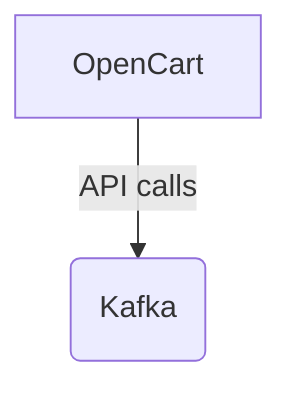

# Connect Kafka to OpenCart

Quix helps you integrate Kafka to OpenCart using pure Python.

<a class="md-button md-button--primary" href="https://share.hsforms.com/1iW0TmZzKQMChk0lxd_tGiw4yjw2?__hstc=175542013.2303933fbd746c0ac86d9ccbe9bc9100.1728383268831.1729603416735.1729620918855.31&__hssc=175542013.1.1729620918855&__hsfp=2132701734" target="_blank" style="margin-right:.5rem;">Book a demo</a>
 

## OpenCart

OpenCart is an open-source online store management system that provides a user-friendly and comprehensive platform for businesses to build and operate their online storefronts. With a vast array of features and functionalities, OpenCart allows users to easily set up their online stores, customize the design and layout, manage products and inventory, accept payments, and track orders and customers. The technology is highly customizable, with a wide range of extensions and themes available to enhance the user experience and tailor the store to specific needs. OpenCart is also optimized for mobile devices, ensuring a seamless shopping experience for customers on any device. Overall, OpenCart is a powerful and flexible technology that empowers businesses to create and manage successful online stores.

## Integrations

Quix is a good fit for integrating with OpenCart because it offers a wide range of features that are beneficial for developing, deploying, and managing real-time data pipelines. 

1. Streamlined Development and Deployment: With integrated online code editors and CI/CD tools, Quix makes it easier to create and deploy data pipelines, which can be useful for integrating with OpenCart's system.

2. Enhanced Collaboration: Quix facilitates efficient collaboration with features like organization and permission management, increasing visibility and control over projects. This can be particularly useful when working on integrations with OpenCart.

3. Real-Time Monitoring: Quix Cloud provides tools for real-time monitoring of pipeline performance and critical metrics, which can help ensure that data pipelines are running smoothly when integrating with OpenCart.

4. Flexible Scaling and Management: Users can easily scale resources, manage CPU and memory, and handle multiple environments linked to Git branches, which can be important for managing the integration with OpenCart effectively.

5. Security and Compliance: With secure management of secrets and compliance features, Quix ensures that data pipelines are being managed securely, which is crucial when dealing with sensitive data from OpenCart.

6. Development Tools: Quix Cloud offers a range of development tools, such as online code editors and connectors for various data sources and sinks, which can support the integration with OpenCart.

7. Data Exploration and Visualization: Users can query and explore data using waveform and table views, and visualize messages and metrics in real-time, which can be beneficial for analyzing data from OpenCart.

Overall, Quix's features such as streamlined development and deployment, enhanced collaboration, real-time monitoring, flexible scaling, security and compliance, development tools, and data exploration and visualization make it a good fit for integrating with OpenCart. Additionally, the integration with Kafka through Quix Streams can provide additional benefits for processing data in real-time from OpenCart.

