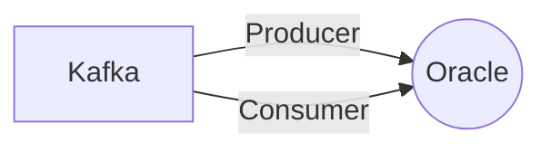

# Connect Kafka to Oracle

Quix helps you integrate Kafka to Oracle using pure Python.

## Oracle

Oracle is a powerful and widely used relational database management system (RDBMS) that allows businesses to securely store and manage vast amounts of data. It is known for its reliability, performance, and scalability, making it a popular choice for organizations of all sizes. Oracle also offers a wide range of additional features and tools, such as data warehousing, business intelligence, and cloud services, to help companies effectively analyze and utilize their data. With its robust security measures and comprehensive support, Oracle is a trusted technology solution for many industries, including finance, healthcare, and retail.

## Integrations

Quix is a good fit for integrating with Oracle technology for multiple reasons. Firstly, the platform offers streamlined development and deployment processes, making it easier to create and deploy data pipelines within an Oracle environment. The integrated online code editors and CI/CD tools simplify the development process, ensuring smooth integration with Oracle systems.

Additionally, Quix Cloud facilitates enhanced collaboration through organization and permission management features, which can be beneficial for teams working on Oracle-related projects. The real-time monitoring capabilities of the platform allow for the efficient tracking of pipeline performance and critical metrics, ensuring that Oracle systems are running smoothly.

The flexible scaling and management options provided by Quix Cloud are also advantageous when integrating with Oracle technology. Users can easily adjust resources, manage CPU and memory, and handle multiple environments linked to Git branches, making it simple to scale Oracle systems as needed.

Moreover, the security and compliance features of Quix Cloud align well with the requirements of Oracle environments. The platform ensures secure management of secrets and compliance with dedicated infrastructure options and SLAs, which are crucial considerations when working with sensitive data in Oracle systems.

Overall, the features and capabilities of both Quix Streams and Quix Cloud make them well-suited for integration with Oracle technology, providing a comprehensive solution for developing, deploying, and managing real-time data pipelines within Oracle environments.

