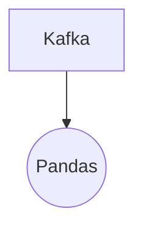

# Connect Kafka to Pandas

Quix helps you integrate Kafka to Pandas using pure Python.

## Pandas

Pandas is a powerful open-source data manipulation and analysis tool for the Python programming language. It provides data structures and functions that make working with structured data easier and more efficient. With Pandas, users can easily load, manipulate, and analyze data from various sources such as CSV files, Excel spreadsheets, SQL databases, and more. Its DataFrame data structure allows for easy handling of data in a tabular format, making it perfect for tasks like data cleaning, exploration, and transformation. Pandas also offers powerful indexing capabilities, time series functionality, and integration with other Python libraries, making it a valuable tool for data scientists, analysts, and engineers working with big data.

## Integrations

Quix is a good fit for integrating with Pandas because Pandas is a popular library in the Python ecosystem for data manipulation and analysis. With Quix Streams' Python-friendly interface and seamless integration with Pandas, developers can easily process and analyze data from Kafka streams using Pandas' powerful features.

Additionally, Quix Streams' support for serialization and state management, time window aggregations, and container orchestration for resilient scaling align well with Pandas' capabilities. This allows developers to efficiently work with and manipulate data in real-time, while utilizing Pandas' functionalities for data analytics and processing.

Furthermore, Quix Streams' support for local and Jupyter Notebook development environments makes it convenient for developers to use Pandas for exploring and visualizing data during the development and debugging process. By leveraging the strengths of both Quix and Pandas, developers can create robust data pipelines and gain valuable insights from real-time data streams.

