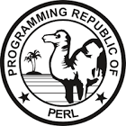
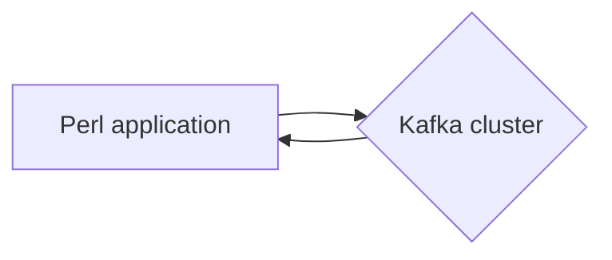

# Connect Kafka to Perl

Quix helps you integrate Kafka to Perl using pure Python.

<a class="md-button md-button--primary" href="https://share.hsforms.com/1iW0TmZzKQMChk0lxd_tGiw4yjw2?__hstc=175542013.2303933fbd746c0ac86d9ccbe9bc9100.1728383268831.1729603416735.1729620918855.31&__hssc=175542013.1.1729620918855&__hsfp=2132701734" target="_blank" style="margin-right:.5rem;">Book a demo</a>
 

## Perl

Perl is a high-level, general-purpose programming language that is known for its flexibility and text processing capabilities. Originally created in 1987 by Larry Wall, Perl has since become a popular language for web development, system administration, and network programming. Perl's syntax is known for its readability and flexibility, allowing programmers to write code that is both concise and powerful. One of Perl's key features is its support for regular expressions, which allows for advanced text manipulation and pattern matching. Perl is also highly extensible, with a large library of modules available for a wide range of tasks. Overall, Perl is a versatile and powerful technology that is used in a variety of industries for a multitude of applications.

## Integrations

Quix is a good fit for integrating with Perl because of its comprehensive platform designed for developing, deploying, and managing real-time data pipelines. Perl is a versatile programming language that is often used for scripting, web development, and automation tasks. By integrating Quix with Perl, users can leverage the streamlined development and deployment features of Quix to create powerful data pipelines using Perl scripts.

Additionally, the enhanced collaboration capabilities of Quix make it easier for teams to work together on Perl-based projects, with organization and permission management tools to increase project visibility and control. Quix's real-time monitoring and scaling capabilities also allow users to efficiently monitor the performance of their Perl scripts and easily scale resources as needed.

Furthermore, Quix's support for various data sources and sinks, as well as its integration with Git providers like GitHub, make it seamless to incorporate Perl scripts into CI/CD processes. The platform's dedicated infrastructure options also ensure secure management of secrets and compliance with industry standards.

Overall, by integrating Quix with Perl, users can take advantage of Quix's robust features to streamline the development, deployment, and management of real-time data pipelines using Perl scripts.

