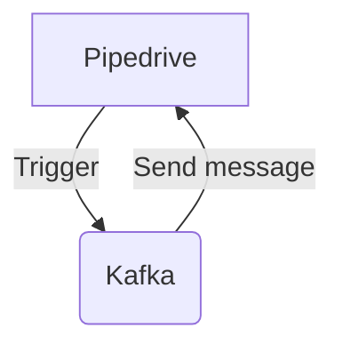

# Connect Kafka to Pipedrive

Quix helps you integrate Kafka to Pipedrive using pure Python.

## Pipedrive

Pipedrive is a powerful sales CRM software designed to help businesses organize and track their sales processes more efficiently. The technology is known for its user-friendly interface and intuitive features, making it easy for sales teams to manage leads, contacts, and deals in one centralized platform. Pipedrive offers a range of tools such as sales pipeline management, email integration, and goal tracking to streamline sales operations and improve overall performance. With its customization options and robust reporting capabilities, Pipedrive empowers businesses to optimize their sales strategies and drive growth.

## Integrations

Quix Streams and Quix Cloud would be a good fit for integrating with Pipedrive because of their scalability, real-time monitoring, and development tools.

1. Scalability: Pipedrive deals with a large amount of data from various sources, and having a scalable platform like Quix Cloud to develop, deploy, and manage real-time data pipelines can help handle the volume of data efficiently.

2. Real-time Monitoring: Pipedrive relies on real-time data to drive sales and marketing decisions. Quix Cloud's real-time monitoring capabilities would allow Pipedrive users to track pipeline performance and critical metrics in real-time, ensuring that the data being processed is accurate and up to date.

3. Development Tools: Quix Streams' user-friendly interface and Python ecosystem integration make it easy for developers to create and deploy data pipelines using familiar tools. This would streamline the integration process with Pipedrive and allow for quick development and deployment of pipelines.

Overall, Quix Streams and Quix Cloud's scalability, real-time monitoring, and development tools make them a good fit for integrating with Pipedrive to enhance data processing and drive informed business decisions.

