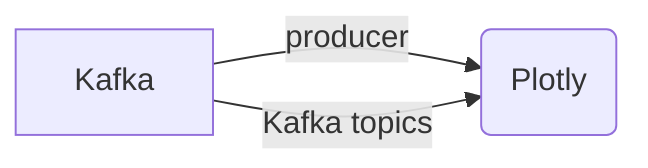

# Connect Kafka to Plotly

Quix helps you integrate Kafka to Plotly using pure Python.

## Plotly

Plotly is a powerful data visualization technology that allows users to create interactive plots, dashboards, and graphs with ease. It offers a wide range of customizable options for creating visually appealing and informative visualizations, such as line charts, bar charts, scatter plots, and more. Users can easily import data from various sources and merge it to create complex visualizations that tell a story and reveal insights. Additionally, Plotly's interactive features allow for zooming, panning, and hovering over data points to display additional information. With its user-friendly interface and extensive documentation, Plotly is a popular choice for data analysts, scientists, and researchers looking to create compelling visual representations of their data.

## Integrations

Plotly is a powerful data visualization library that is commonly used in Python for creating interactive plots and charts. Integrating Quix with Plotly would be a good fit for several reasons:

1. Data Exploration and Visualization: Quix Streams provides tools for querying and exploring data in real-time, making it easy to extract the necessary data for visualization with Plotly. Users can then create interactive graphs, dashboards, and visualizations to gain insights from their data.

2. Python Integration: Quix Streams is built for processing data in Kafka using Python, which aligns well with Plotly's capabilities in Python. The seamless integration between Quix Streams and Plotly allows users to leverage the full power of both platforms for data processing, analysis, and visualization.

3. Real-Time Monitoring: Quix Cloud offers real-time monitoring capabilities for tracking pipeline performance and critical metrics. By combining this feature with Plotly's interactive visualizations, users can easily monitor and analyze data streams in real-time, spotting trends, anomalies, and patterns as they occur.

4. Enhanced Collaboration: Quix Cloud's collaboration features, such as organization and permission management, can help teams work together efficiently on data projects. With Plotly's ability to create interactive plots and share visualization results, teams can collaborate more effectively by sharing insights and findings in a clear and interactive format.

Overall, integrating Quix with Plotly can provide a comprehensive solution for developing, deploying, and visualizing real-time data pipelines, making it easier for users to manipulate and analyze data while gaining valuable insights from visualizations.

