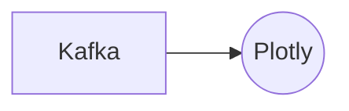

# Connect Kafka to Plotly

Quix helps you integrate Kafka to Plotly using pure Python.

- __Find out how we can help you integrate!__

    <a class="md-button md-button--primary" href="https://share.hsforms.com/1iW0TmZzKQMChk0lxd_tGiw4yjw2?__hstc=175542013.2303933fbd746c0ac86d9ccbe9bc9100.1728383268831.1729603416735.1729620918855.31&__hssc=175542013.1.1729620918855&__hsfp=2132701734" target="_blank" style="margin:.5rem;">Book a demo</a>

## Plotly

Plotly is a powerful data visualization technology that allows users to create interactive graphs, charts, and dashboards with ease. With options for creating scatter plots, line graphs, bar charts, and more, Plotly is versatile and customizable, making it suitable for a wide range of data analysis and presentation needs. Users can easily incorporate multiple data sets, and customize colors, labels, and other visual elements to create compelling and informative visualizations. With features for sharing and collaborating on projects, Plotly is a popular choice for individuals and teams looking to make their data come to life in a dynamic and engaging way.

## Integrations

Quix is a good fit for integrating with Plotly because it offers a comprehensive platform for developing, deploying, and managing real-time data pipelines. Plotly is a popular data visualization library that allows users to create interactive plots and charts. By integrating Quix with Plotly, users can streamline the process of visualizing data from their pipelines in real-time.

Some key reasons why Quix is a good fit for integrating with Plotly include:

1. Real-Time Monitoring: Quix Cloud provides tools for real-time logs, metrics, and data exploration, allowing users to monitor pipeline performance and critical metrics. By integrating with Plotly, users can easily create real-time visualizations to track the progress and performance of their data pipelines.

2. Data Exploration and Visualization: Quix Cloud supports data exploration and visualization features, allowing users to query and explore data using waveform and table views. By integrating with Plotly, users can enhance their data exploration capabilities by creating interactive and dynamic visualizations of their data.

3. Flexible Scaling and Management: Quix Cloud offers flexible scaling and management options, allowing users to easily scale resources and manage CPU and memory. By integrating with Plotly, users can efficiently visualize and analyze data at scale, ensuring that their visualizations can adapt to changing data volume and complexity.

4. Python Ecosystem Integration: Quix Streams, Quix's cloud-native library for processing data in Kafka using Python, seamlessly integrates with the Python ecosystem. Since Plotly is also compatible with Python, the integration of Quix with Plotly enables users to leverage the power of Python libraries like Pandas, scikit-learn, TensorFlow, and PyTorch for data processing and visualization.

Overall, integrating Quix with Plotly enhances the data visualization capabilities of Quix Cloud, allowing users to create interactive and dynamic plots and charts to effectively monitor and analyze their real-time data pipelines.

