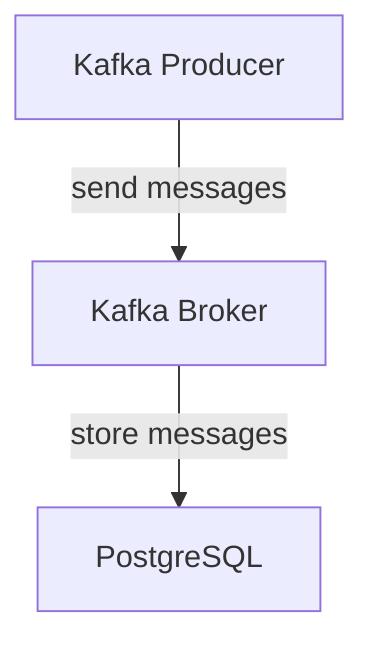

# Connect Kafka to PostgreSQL

Quix helps you integrate Kafka to PostgreSQL using pure Python.

## PostgreSQL

PostgreSQL is a powerful, open source relational database management system that is known for its robust functionality and scalability. It is designed to handle a wide range of workloads, from small applications to large, enterprise-level systems. PostgreSQL supports a variety of data types, including text, numeric, boolean, and geometric, making it versatile for a wide range of applications. It also offers advanced features such as support for transactions, foreign keys, and triggers, as well as a rich set of indexing options for optimizing query performance. Additionally, PostgreSQL is known for its strong compliance with SQL standards, making it easy for developers to migrate their databases between different platforms. Overall, PostgreSQL is a popular choice for many organizations looking for a reliable, high-performance database solution.

## Integrations

Quix is a good fit for integrating with PostgreSQL because both platforms prioritize streamlined development, enhanced collaboration, real-time monitoring, scaling capabilities, and security. 

Quix Cloud offers a comprehensive platform with streamlined development and deployment processes, which can be beneficial when integrating with PostgreSQL. The integrated online code editors and CI/CD tools provided by Quix Cloud make it easier to create and deploy data pipelines that interact with a PostgreSQL database. Additionally, the platform supports efficient collaboration through organization and permission management, which can help teams working with PostgreSQL to coordinate and manage their projects effectively.

Furthermore, Quix Cloud provides real-time monitoring tools that allow users to track the performance and critical metrics of their data pipelines. This monitoring capability can be particularly useful when integrating with PostgreSQL to ensure that data is being processed and stored correctly. Additionally, the flexible scaling and management features of Quix Cloud make it easy to adjust resources and manage environments when working with PostgreSQL.

In terms of security and compliance, Quix Cloud ensures the secure management of secrets and compliance with dedicated infrastructure options and SLAs, which is crucial when working with sensitive data stored in a PostgreSQL database. The platform also offers robust development tools, data exploration and visualization capabilities, as well as integration with Kafka solutions, all of which can enhance the integration process with PostgreSQL.

On the other hand, Quix Streams is a cloud-native library that specifically focuses on processing data in Kafka using Python. While it may not have all the comprehensive features of Quix Cloud, its compatibility with Python libraries and support for time window aggregations can be advantageous when integrating with PostgreSQL for real-time data processing and analytics.

Overall, both Quix Streams and Quix Cloud offer features that align well with the requirements of integrating with PostgreSQL, making them suitable choices for developers and data engineers looking to streamline their data pipelines and enhance collaboration when working with PostgreSQL databases.

