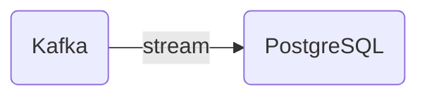

# Connect Kafka to PostgreSQL

Quix helps you integrate Kafka to PostgreSQL using pure Python.

<a class="md-button md-button--primary" href="https://share.hsforms.com/1iW0TmZzKQMChk0lxd_tGiw4yjw2?__hstc=175542013.2303933fbd746c0ac86d9ccbe9bc9100.1728383268831.1729603416735.1729620918855.31&__hssc=175542013.1.1729620918855&__hsfp=2132701734" target="_blank" style="margin-right:.5rem;">Book a demo</a>
 

## PostgreSQL

PostgreSQL, also known as Postgres, is an open-source object-relational database management system that is highly reliable and has a proven track record of stability and performance. It is known for its advanced features such as full ACID compliance, extensibility, and support for a variety of data types, including JSON, XML, and arrays. PostgreSQL also offers a robust set of capabilities for managing complex data structures, including support for advanced indexing, transactions, and concurrency control. With its active community of developers and frequent updates, PostgreSQL continues to be a popular choice for organizations seeking a powerful and scalable database solution.

## Integrations

Quix is a good fit for integrating with PostgreSQL because it offers a comprehensive platform for developing, deploying, and managing real-time data pipelines. PostgreSQL is a popular open-source relational database management system known for its reliability, scalability, and extensibility. By integrating with Quix, users can leverage the streamlined development and deployment features to easily create data pipelines that interact with PostgreSQL databases.

Additionally, Quix provides enhanced collaboration capabilities, real-time monitoring, flexible scaling, and management features that align well with the needs of organizations using PostgreSQL for their data storage and processing needs. The platform supports secure management of secrets, compliance with dedicated infrastructure options, and robust CI/CD processes, which are important considerations when working with sensitive data in a PostgreSQL environment.

Furthermore, Quix Streams, a cloud-native library for processing data in Kafka using Python, can also be integrated with PostgreSQL to facilitate seamless data processing and analytics workflows. The library's support for serialization and state management, time window aggregations, and resilient scaling align well with the requirements of working with PostgreSQL data.

Overall, the combination of Quix's comprehensive platform features and support for Python-based data processing libraries makes it a great fit for integrating with PostgreSQL for building scalable and efficient data pipelines and analytics solutions.

