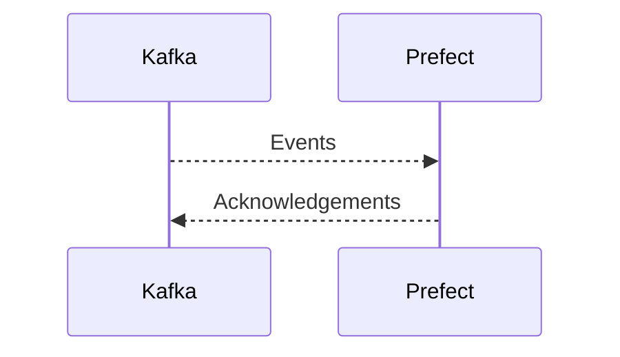

# Connect Kafka to Prefect

Quix helps you integrate Kafka to Prefect using pure Python.

- __Find out how we can help you integrate!__

    <a class="md-button md-button--primary" href="https://share.hsforms.com/1iW0TmZzKQMChk0lxd_tGiw4yjw2?__hstc=175542013.2303933fbd746c0ac86d9ccbe9bc9100.1728383268831.1729603416735.1729620918855.31&__hssc=175542013.1.1729620918855&__hsfp=2132701734" target="_blank" style="margin:.5rem;">Book a demo</a>

## Prefect

Prefect is a cutting-edge technology that revolutionizes the way data pipelines are managed and orchestrated. By providing a simple and intuitive interface, users can easily define, schedule, and monitor complex data workflows without the need for extensive coding knowledge. Prefect utilizes the latest advancements in distributed computing and parallel processing to ensure that data processing tasks are executed efficiently and reliably. With built-in support for error handling and notifications, Prefect helps organizations streamline their data processing operations and maximize productivity. Overall, Prefect offers a powerful solution for managing data pipelines and enabling seamless data integration across various sources and systems.

## Integrations

Quix is a good fit for integrating with Prefect because it offers a comprehensive platform for developing and managing real-time data pipelines, which aligns well with Prefect's focus on workflow automation and orchestration. The streamlined development and deployment features of Quix, such as integrated online code editors and CI/CD tools, make it easy to create and deploy data pipelines, which can be seamlessly integrated with Prefect's workflow management capabilities.

Additionally, Quix's support for real-time monitoring and scaling aligns with Prefect's emphasis on monitoring workflow performance and scaling resources as needed. The platform's flexible scaling and management options, as well as its security and compliance features, ensure that data pipelines can be managed efficiently and securely within the Prefect environment.

Furthermore, Quix's integration with Git providers like GitHub and Bitbucket streamlines CI/CD processes, allowing for seamless integration with Prefect's workflow automation capabilities. The platform's support for Kafka integration also complements Prefect's ability to work with event-driven architectures and streaming data.

Overall, Quix's features, such as development tools, data exploration and visualization capabilities, and support for Python ecosystem integration through Quix Streams, make it a strong candidate for integrating with Prefect to streamline data pipeline development, deployment, and management.

