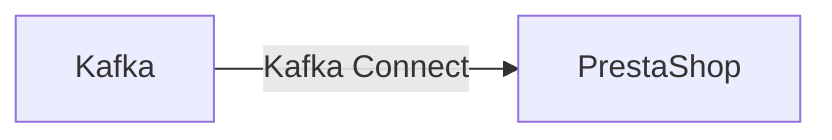

# Connect Kafka to PrestaShop

Quix helps you integrate Kafka to PrestaShop using pure Python.

## PrestaShop

PrestaShop is a popular open-source e-commerce platform used by businesses to create and manage online stores. It offers a wide range of features and tools that allow users to customize their store's design, manage inventory, process orders, and track customer data. PrestaShop is highly flexible and scalable, making it a great solution for businesses of all sizes. Its user-friendly interface and extensive marketplace of modules and themes make it easy for users to enhance their store's functionality and appearance. Overall, PrestaShop is a powerful and versatile e-commerce platform that helps businesses create and maintain successful online stores.

## Integrations

Quix is a good fit for integrating with PrestaShop because it offers a comprehensive platform with features that align well with the needs of integrating with an e-commerce platform like PrestaShop. 

1. Streamlined Development and Deployment: The integrated online code editors and CI/CD tools in Quix Cloud make it easier to develop and deploy data pipelines, which can be crucial for integrating with PrestaShop and managing real-time data.

2. Enhanced Collaboration: With organization and permission management features, Quix Cloud enables efficient collaboration among team members, which can be valuable when integrating with a complex system like PrestaShop.

3. Real-Time Monitoring: The tools provided by Quix Cloud for real-time monitoring of pipeline performance and critical metrics can help ensure that data is flowing smoothly between PrestaShop and other systems.

4. Flexible Scaling and Management: The ability to easily scale resources and handle multiple environments in Quix Cloud can be beneficial for managing the data pipelines needed for integrating with PrestaShop.

5. Security and Compliance: Quix Cloud offers secure management of secrets and compliance features, which are important when dealing with sensitive data in an e-commerce platform like PrestaShop.

6. Development Tools: The online code editors, code templates, and connectors provided by Quix Cloud can streamline the development process when integrating with PrestaShop.

7. Data Exploration and Visualization: The data exploration and visualization capabilities of Quix Cloud can help users gain insights and make informed decisions when working with data from PrestaShop.

Overall, the features offered by Quix make it a suitable choice for integrating with PrestaShop, providing the necessary tools and capabilities to effectively manage, monitor, and scale real-time data pipelines between the two systems.

