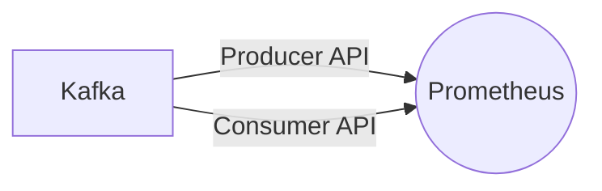

# Connect Kafka to Prometheus

Quix helps you integrate Kafka to Prometheus using pure Python.

## Prometheus

Prometheus is an advanced monitoring and alerting tool that is widely used in the field of DevOps and system administration. Developed by SoundCloud in 2012, Prometheus is an open-source software application that collects and stores metrics from systems and services in real-time. It is designed to help users gain insight into the performance and health of their applications by monitoring various metrics such as CPU usage, memory allocation, and network traffic. With its powerful querying language and flexible alerting capabilities, Prometheus enables users to detect and respond to issues quickly, ultimately improving the reliability and efficiency of their systems.

## Integrations

Prometheus is a popular monitoring and alerting tool used for tracking metrics and monitoring the health of various systems and services. When integrating Prometheus with Quix, there are several key reasons why it is a good fit:

1. Real-Time Monitoring: Quix Cloud's real-time monitoring capabilities align well with Prometheus, which can scrape metrics from various sources in real-time. By integrating with Prometheus, users can effectively monitor the performance of their data pipelines and quickly identify any issues or bottlenecks.

2. Flexible Scaling and Management: Quix Cloud's flexible scaling and management features complement Prometheus's ability to dynamically adjust monitoring targets based on changes in the environment. This ensures that Prometheus can effectively monitor the evolving infrastructure and resources managed by Quix Cloud.

3. Security and Compliance: Both Quix Cloud and Prometheus prioritize security and compliance, making them a good fit for organizations that require robust data monitoring and management practices. By integrating with Prometheus, users can ensure that their monitoring solution meets the necessary security and compliance standards.

4. Data Exploration and Visualization: Quix Cloud's data exploration and visualization capabilities can enhance the monitoring experience when integrated with Prometheus. Users can leverage Prometheus's rich set of metrics and Quix Cloud's visualization tools to gain valuable insights into the performance of their data pipelines.

5. Robust CI/CD Processes: The integration of Prometheus with Quix Cloud can streamline CI/CD processes by providing real-time monitoring and alerting capabilities. This ensures that any issues detected by Prometheus can be quickly addressed and resolved during the development and deployment stages.

Overall, the combination of Quix with Prometheus offers a comprehensive solution for developing, deploying, and monitoring data pipelines in real-time. By leveraging the strengths of both platforms, users can achieve enhanced visibility, control, and performance optimization for their data processing workflows.

