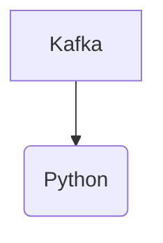

# Connect Kafka to Python

Quix helps you integrate Kafka to Python using pure Python.

## Python

Python is a high-level, interpreted programming language known for its simplicity and readability. Developed in the late 1980s, Python has become one of the most popular languages for a wide range of applications, from web development and data science to machine learning and artificial intelligence. Its clean syntax and extensive standard library make it easy for beginners to learn, while its flexibility and powerful features make it a favorite among experienced developers. Python's dynamic typing and automatic memory management contribute to its ease of use and efficiency, while its compatibility with other programming languages and platforms ensures its versatility. Overall, Python is a versatile and powerful technology that continues to gain popularity and influence in the world of software development.

## Integrations

Quix is a good fit for integrating with Python due to its seamless integration with the Python ecosystem. Python is a popular programming language in the data science and machine learning fields, and Quix Streams and Quix Cloud provide a user-friendly Python interface for processing data in real-time pipelines.

Additionally, Quix Streams offers benefits such as serialization and state management support, time window aggregations, and resilient scaling capabilities, all of which are essential features for data processing workflows in Python. With its integration with tools like Pandas, scikit-learn, TensorFlow, and PyTorch, developers can leverage their existing Python skills and libraries to easily build and deploy data pipelines on the platform.

Furthermore, the platform's support for local and Jupyter Notebook development environments makes it convenient for Python developers to develop and debug their code. By leveraging Quix's capabilities for streamlined development, enhanced collaboration, real-time monitoring, and flexible scaling, Python developers can efficiently build and manage real-time data pipelines with ease.

