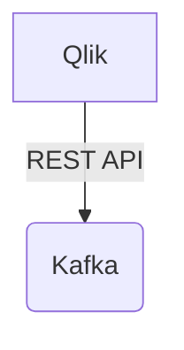

# Connect Kafka to Qlik

Quix helps you integrate Kafka to Qlik using pure Python.

## Qlik

Qlik is a powerful data analytics and visualization platform that enables organizations to easily explore and analyze their data in a visually engaging way. With Qlik, users can easily connect to various data sources, combine different data sets, and create interactive dashboards and reports to gain valuable insights. One of the key features of Qlik is its associative engine, which allows users to dynamically explore relationships between different data elements and uncover hidden patterns and trends. This technology provides a user-friendly interface that empowers users to make data-driven decisions quickly and efficiently. Overall, Qlik helps organizations unlock the true potential of their data and drive business success.

## Integrations

Quix is a good fit for integrating with the Qlik technology because they both offer features that are complementary to each other and can enhance the overall data processing and visualization capabilities. 

Quix Streams, with its ability to process data in Kafka using Python, can seamlessly integrate with Qlik's data visualization and exploration tools. The Python ecosystem integration in Quix Streams allows for easy collaboration between data processing and visualization teams, as both can leverage popular Python libraries for their respective tasks. 

Additionally, Quix Streams' support for time window aggregations and resilient scaling align well with Qlik's focus on real-time data monitoring and analysis. The ability to process data in real-time and aggregate over specific time windows is crucial for organizations looking to extract meaningful insights from their data streams.

Furthermore, Quix Cloud's features such as enhanced collaboration, real-time monitoring, and flexible scaling can provide added value to Qlik users by streamlining the development and management of data pipelines. The platform's dedicated infrastructure options and compliance measures ensure data security and adherence to regulatory standards, which are essential considerations for organizations dealing with sensitive data.

In conclusion, integrating Quix with Qlik can offer a comprehensive solution for organizations looking to streamline their data processing, visualization, and analysis workflows. By leveraging the strengths of both technologies, users can benefit from a robust and efficient data pipeline that meets their specific requirements and enables them to derive valuable insights from their data streams.

