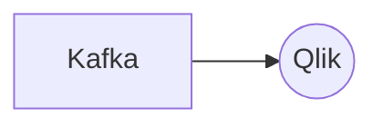

# Connect Kafka to Qlik

Quix helps you integrate Kafka to Qlik using pure Python.

<a class="md-button md-button--primary" href="https://share.hsforms.com/1iW0TmZzKQMChk0lxd_tGiw4yjw2?__hstc=175542013.2303933fbd746c0ac86d9ccbe9bc9100.1728383268831.1729603416735.1729620918855.31&__hssc=175542013.1.1729620918855&__hsfp=2132701734" target="_blank" style="margin-right:.5rem;">Book a demo</a>
 

## Qlik

Qlik is a powerful data analytics platform that enables users to visualize and analyze complex data sets. The technology allows users to easily explore, manipulate, and interpret data from various sources in real-time, helping them gain valuable insights and make informed decisions. Qlik uses interactive and intuitive visualizations, such as charts, graphs, and dashboards, to present data in a clear and easily understandable format. Its associative model also enables users to quickly navigate through large data sets, making it easier to identify correlations and patterns. With Qlik, organizations can streamline their data analysis processes, improve operational efficiency, and drive business growth.

## Integrations

Quix is a good fit for integrating with Qlik because of its robust features that align well with the capabilities of Qlik technology. For example, Quix Cloud offers streamlined development and deployment tools that can enhance the process of creating and deploying data pipelines within Qlik's environment. The platform's real-time monitoring and scaling capabilities can complement Qlik's data visualization and exploration capabilities, allowing users to monitor pipeline performance and visualize data in real-time.

Additionally, Quix's integration with Kafka aligns with Qlik's ability to handle real-time data processing and analytics. Quix Streams, a cloud-native library for processing data in Kafka using Python, can enhance data processing capabilities within Qlik by providing a scalable and user-friendly interface.

Furthermore, Quix's support for collaboration, security, and compliance features can help enhance data management and governance within Qlik's ecosystem. The platform's dedicated infrastructure options and integration with Git providers can facilitate seamless CI/CD processes and enhance project visibility and control within Qlik.

Overall, the combination of Quix's comprehensive platform for developing, deploying, and managing real-time data pipelines with Qlik's data visualization and analytics capabilities make them a good fit for integration, providing users with a powerful and efficient solution for their data processing and analytics needs.

