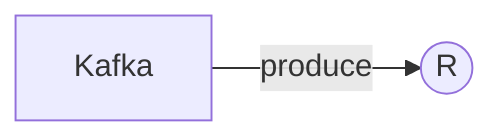

# Connect Kafka to R

Quix helps you integrate Kafka to R using pure Python.

## R

R is a programming language and software environment widely used for statistical computing and data analysis. Developed initially for academic research, R has gained popularity in industries such as finance, bioinformatics, and medicine due to its powerful data manipulation and visualization capabilities. R allows users to create complex statistical models, generate high-quality graphs, and perform a wide range of statistical tests. Its extensive library of packages makes it easy for users to access additional functionality and tools for specific tasks. Overall, R is a versatile and robust technology that has become an essential tool for many data scientists and analysts.

## Integrations

Quix is a good fit for integrating with the technology called R because it provides a comprehensive platform for developing, deploying, and managing real-time data pipelines. R is a popular language and environment for statistical computing and graphics, commonly used for data analysis and visualization. 

With Quix Cloud's streamlined development and deployment features, users can easily create data pipelines and integrate R scripts for data analysis. The platform's enhanced collaboration capabilities facilitate teamwork among data scientists and developers working with R, increasing efficiency and project visibility. 

Additionally, Quix Cloud's real-time monitoring tools allow users to track the performance of R scripts and data pipelines, ensuring optimal functioning and quick issue resolution. The platform's flexible scaling and management options enable users to adjust resources as needed to accommodate the demands of running R scripts and processing data in real-time.

Overall, Quix's integration with R allows for seamless development and deployment of data pipelines, efficient collaboration, real-time monitoring, and flexible scaling capabilities, making it a suitable choice for organizations utilizing R for data analysis and processing.

