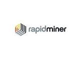
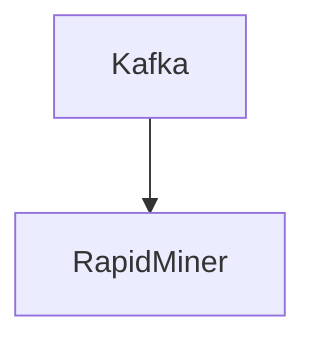

# Connect Kafka to RapidMiner

Quix helps you integrate Kafka to RapidMiner using pure Python.

<a class="md-button md-button--primary" href="https://share.hsforms.com/1iW0TmZzKQMChk0lxd_tGiw4yjw2?__hstc=175542013.2303933fbd746c0ac86d9ccbe9bc9100.1728383268831.1729603416735.1729620918855.31&__hssc=175542013.1.1729620918855&__hsfp=2132701734" target="_blank" style="margin-right:.5rem;">Book a demo</a>
 

## RapidMiner

RapidMiner is a data science platform that enables organizations to easily gather, analyze, and visualize large amounts of data to make informed business decisions. With its intuitive interface and drag-and-drop functionality, users can quickly build and deploy machine learning models without the need for extensive coding knowledge. RapidMiner also offers a wide range of pre-built templates, algorithms, and tools to expedite the data mining process and maximize efficiency. Additionally, the platform provides real-time insights and predictions, allowing users to stay one step ahead in today's fast-paced business environment. RapidMiner is a versatile and powerful tool that empowers organizations to harness the full potential of their data for strategic advantage.

## Integrations

Quix is a good fit for integrating with RapidMiner because it offers a comprehensive platform for developing, deploying, and managing real-time data pipelines. RapidMiner is a data science platform that provides advanced analytics tools to help organizations make data-driven decisions.

Quix's streamlined development and deployment capabilities, along with its enhanced collaboration features, make it easy for RapidMiner users to create and deploy data pipelines efficiently. The platform's real-time monitoring tools also align well with RapidMiner's focus on providing real-time insights and analytics.

Additionally, Quix's flexible scaling and management options, as well as its robust CI/CD processes, can further enhance RapidMiner users' workflow and productivity. Integration with Git providers like GitHub and Bitbucket also allows for seamless collaboration and version control.

Furthermore, Quix's support for Kafka integration complements RapidMiner users' data processing needs, while its dedicated/BYOC options provide flexibility in running pipelines on dedicated infrastructure. The platform's security and compliance features also ensure that data remains secure and compliant with regulations.

Overall, Quix's features such as data exploration and visualization, Python ecosystem integration, and support for serialization and state management make it a valuable tool for integrating with RapidMiner and enhancing data processing capabilities.

