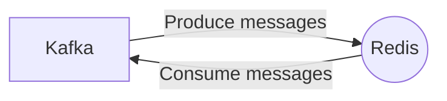

# Connect Kafka to Redis

Quix helps you integrate Kafka to Redis using pure Python.

## Redis

Redis is an open-source, in-memory data structure store that is commonly used as a caching mechanism and database. It is known for its fast performance, scalability, and versatility, making it a popular choice for applications that require real-time data processing. Redis supports a variety of data types, including strings, hashes, lists, sets, and sorted sets, and provides powerful features such as data persistence, replication, and clustering. Its simple yet powerful API allows developers to easily manipulate and retrieve data, making it a valuable tool for building high-performance, real-time applications.

## Integrations

Quix is a good fit for integrating with Redis because Redis is a high-performance, in-memory data store that is commonly used for caching, session management, and real-time analytics. By integrating Redis with Quix, users can enhance the performance and scalability of their real-time data pipelines.

One of the key features of Quix Streams is its support for serialization and state management using RocksDB. This aligns well with Redis, which also supports efficient serialization and storage of data in memory. By leveraging Redis as a caching layer within Quix Streams, users can improve the speed and efficiency of their data processing operations.

Additionally, Quix Cloud's real-time monitoring capabilities can be beneficial when integrating with Redis. Users can leverage Redis' built-in monitoring tools to track key metrics and performance indicators, allowing for proactive monitoring and troubleshooting of potential issues.

Overall, the combination of Quix with Redis can offer a powerful solution for managing and processing real-time data pipelines with enhanced performance, scalability, and monitoring capabilities.

