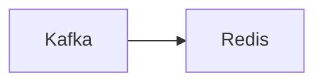

# Connect Kafka to Redis

Quix helps you integrate Kafka to Redis using pure Python.

- __Find out how we can help you integrate!__

    <a class="md-button md-button--primary" href="https://share.hsforms.com/1iW0TmZzKQMChk0lxd_tGiw4yjw2?__hstc=175542013.2303933fbd746c0ac86d9ccbe9bc9100.1728383268831.1729603416735.1729620918855.31&__hssc=175542013.1.1729620918855&__hsfp=2132701734" target="_blank" style="margin:.5rem;">Book a demo</a>

## Redis

Redis is an open-source, in-memory data structure store that is used as a database, cache, and message broker. It is known for its high-performance and low-latency capabilities, making it an ideal solution for applications that require real-time data processing. Redis stores data in key-value pairs, which allows for fast retrieval and storage of data. It also offers various data structures such as lists, sets, and sorted sets, making it versatile for a wide range of use cases. Additionally, Redis supports clustering and replication, providing scalability and high availability for large-scale applications. Overall, Redis is a powerful and efficient technology that is widely used in the industry for various use cases.

## Integrations

Quix is a good fit for integrating with Redis because of its real-time data processing capabilities and the seamless integration with Quix Streams, which is designed specifically for processing data in Kafka using Python.

Redis is a high-performance, in-memory data structure store that is commonly used for caching, session management, and real-time analytics. By integrating Quix with Redis, users can leverage the real-time monitoring and scaling capabilities of Quix Cloud to efficiently process and manage data stored in Redis.

Additionally, Quix Cloud's flexible scaling and management features and robust CI/CD processes make it easier to integrate and manage Redis within a data pipeline. With the ability to easily scale resources, manage CPU and memory, and handle multiple environments, users can ensure optimal performance and scalability when working with Redis data.

Furthermore, the integration with Quix Streams allows users to seamlessly process data from Kafka using Python, making it easier to interact with Redis data within the Kafka ecosystem. By leveraging Quix's streamlined development and deployment tools, users can efficiently process and analyze data stored in Redis in real-time, ultimately improving the overall efficiency and performance of their data pipelines.

