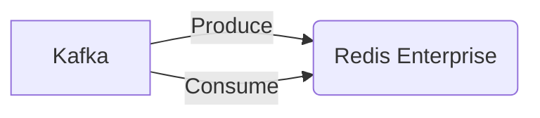

# Connect Kafka to Redis Enterprise

Quix helps you integrate Kafka to Redis Enterprise using pure Python.

<a class="md-button md-button--primary" href="https://share.hsforms.com/1iW0TmZzKQMChk0lxd_tGiw4yjw2?__hstc=175542013.2303933fbd746c0ac86d9ccbe9bc9100.1728383268831.1729603416735.1729620918855.31&__hssc=175542013.1.1729620918855&__hsfp=2132701734" target="_blank" style="margin-right:.5rem;">Book a demo</a>
 

## Redis Enterprise

Redis Enterprise is a cutting-edge technology that offers a highly scalable, high-performance database solution for modern businesses. It is built on the popular open-source Redis database but includes additional features and enhancements to support enterprise-level use cases. With Redis Enterprise, businesses can seamlessly deploy and manage distributed Redis clusters across multiple servers, ensuring high availability and fault tolerance. Its real-time indexing and querying capabilities make it ideal for use in fast-paced, data-intensive applications such as real-time analytics, e-commerce, and gaming. Additionally, Redis Enterprise provides advanced security features and multi-model support, allowing businesses to store a wide variety of data types in a single, powerful database solution. Overall, Redis Enterprise is a versatile and reliable technology that can help businesses handle their most demanding data challenges with ease.

## Integrations

Quix is a good fit for integrating with Redis Enterprise due to several reasons:

1. Real-Time Data Processing: Redis Enterprise is known for its high-performance, real-time data processing capabilities. Quix's focus on real-time data pipelines aligns well with this, allowing users to leverage Redis Enterprise's speed and efficiency for processing and storing data.

2. Scalability and Management: Redis Enterprise offers flexible scaling and management options, which can be effectively utilized by Quix for handling large volumes of data in real-time pipelines. This allows for seamless scaling of resources and efficient management of CPU and memory requirements.

3. Integration with Kafka: Quix supports integration with Kafka, a popular messaging system for real-time data streams. Redis Enterprise can enhance this integration by serving as a high-speed data cache for Kafka messages, improving overall performance and throughput of the data pipelines.

4. Security and Compliance: Redis Enterprise provides secure management of data through dedicated infrastructure options and compliance features. By integrating with Quix, users can ensure that sensitive data processed through real-time pipelines is handled securely and compliantly.

Overall, the combination of Quix's real-time data processing capabilities and Redis Enterprise's speed, scalability, and security features make them a powerful duo for managing and processing real-time data pipelines efficiently.

