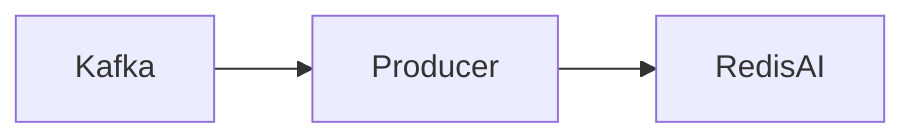

# Connect Kafka to RedisAI

Quix helps you integrate Kafka to RedisAI using pure Python.

- __Find out how we can help you integrate!__

    <a class="md-button md-button--primary" href="https://share.hsforms.com/1iW0TmZzKQMChk0lxd_tGiw4yjw2?__hstc=175542013.2303933fbd746c0ac86d9ccbe9bc9100.1728383268831.1729603416735.1729620918855.31&__hssc=175542013.1.1729620918855&__hsfp=2132701734" target="_blank" style="margin:.5rem;">Book a demo</a>

## RedisAI

RedisAI is a cutting-edge technology that integrates deep learning capabilities into the popular in-memory database system Redis. By combining the high performance and scalability of Redis with the power of deep learning models, RedisAI allows users to efficiently deploy and manage AI applications directly within their database environment. This innovative platform enables real-time inferencing, training, and processing of machine learning models, making it ideal for a wide range of use cases such as natural language processing, image recognition, and recommendation systems. RedisAI revolutionizes the way organizations leverage AI technologies, providing a seamless and efficient solution for incorporating machine learning into their data workflows.

## Integrations

Quix is a good fit for integrating with RedisAI because of its comprehensive platform designed for developing, deploying, and managing real-time data pipelines. RedisAI is an extension of Redis that allows for running deep learning models directly in Redis, enhancing the capabilities of real-time data processing.

With Quix's streamlined development and deployment features, developers can easily integrate RedisAI into their data pipelines and deploy deep learning models efficiently. The platform's real-time monitoring tools also enable users to track the performance of their AI models running in RedisAI, ensuring optimal operation and scalability.

Additionally, Quix's flexible scaling and management capabilities make it easier for users to scale resources and manage CPU and memory for RedisAI deployments. The platform's robust CI/CD processes and integration with Git providers further streamline the development and deployment of AI models in RedisAI.

Overall, Quix's features for collaboration, monitoring, scaling, and security make it a suitable platform for integrating with RedisAI and leveraging its capabilities for real-time data processing and machine learning applications.

