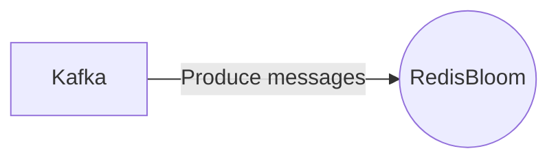

# Connect Kafka to RedisBloom

Quix helps you integrate Kafka to RedisBloom using pure Python.

<a class="md-button md-button--primary" href="https://share.hsforms.com/1iW0TmZzKQMChk0lxd_tGiw4yjw2?__hstc=175542013.2303933fbd746c0ac86d9ccbe9bc9100.1728383268831.1729603416735.1729620918855.31&__hssc=175542013.1.1729620918855&__hsfp=2132701734" target="_blank" style="margin-right:.5rem;">Book a demo</a>
 

## RedisBloom

RedisBloom is a cutting-edge technology that enhances Redis, a popular in-memory data storage system. RedisBloom integrates probabilistic data structures such as Bloom filters, HyperLogLogs, and Top-K along with Redis, enabling users to perform advanced operations like set intersections and unions with high performance and efficiency. This technology is particularly useful in scenarios where space and memory are limited, as it allows data to be stored and manipulated in a space-efficient manner. RedisBloom also offers support for multiple programming languages and can be easily integrated into existing applications, making it a versatile and powerful tool for developers looking to optimize their data storage and retrieval processes.

## Integrations

Quix is a good fit for integrating with RedisBloom because of its comprehensive platform designed for developing, deploying, and managing real-time data pipelines. RedisBloom is a Redis module that provides probabilistic data structures such as Bloom filters, Count-Min Sketches, and Top-K. 

Quix's Streamlined Development and Deployment feature, with integrated online code editors and CI/CD tools, can simplify the process of incorporating RedisBloom into data pipelines. The platform's ability to define pipelines and environment variables as code using YAML synchronization can also make it easier to integrate RedisBloom into the pipeline configuration.

Additionally, Quix Cloud's Real-Time Monitoring capabilities can be utilized to monitor the performance of RedisBloom within the data pipeline. Users can leverage the tools provided by Quix Cloud to track metrics related to RedisBloom's usage and performance in real-time.

Furthermore, Quix's Flexible Scaling and Management features allow users to easily scale resources and manage CPU and memory usage for RedisBloom. With the ability to handle multiple environments linked to Git branches, users can efficiently manage different configurations and instances of RedisBloom within their data pipelines.

Overall, Quix's collaborative, monitoring, scaling, and development tools make it a suitable platform for integrating with RedisBloom and leveraging its capabilities within real-time data pipelines.

