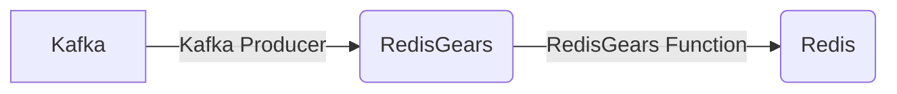

# Connect Kafka to RedisGears

Quix helps you integrate Kafka to RedisGears using pure Python.

<a class="md-button md-button--primary" href="https://share.hsforms.com/1iW0TmZzKQMChk0lxd_tGiw4yjw2?__hstc=175542013.2303933fbd746c0ac86d9ccbe9bc9100.1728383268831.1729603416735.1729620918855.31&__hssc=175542013.1.1729620918855&__hsfp=2132701734" target="_blank" style="margin-right:.5rem;">Book a demo</a>
 

## RedisGears

RedisGears is a powerful technology that allows developers to build and execute complex data processing workflows within Redis, a popular in-memory data store. With RedisGears, developers can write custom functions in JavaScript to perform tasks such as data transformation, filtering, aggregation, and enrichment directly within Redis, enabling real-time data processing and analytics. RedisGears also supports distributed execution, parallel processing, and fault tolerance, making it ideal for high-performance, scalable applications. This technology offers a flexible and efficient solution for a wide range of use cases, from real-time data streaming and event processing to machine learning model serving and ETL (extract, transform, load) pipelines.

## Integrations

Quix is a good fit for integrating with RedisGears because of its focus on real-time data processing and pipeline management. The features offered by Quix Cloud, such as streamlined development and deployment, enhanced collaboration, real-time monitoring, and flexible scaling, align well with the capabilities of RedisGears.

Since RedisGears is a real-time data processing engine that allows for executing Python code directly within the Redis database, the integration with Quix could provide developers with a seamless and efficient way to create, deploy, and manage data pipelines that involve RedisGears functionalities. 

Additionally, Quix Streams, which is a cloud-native library for processing data in Kafka using Python, can further enhance the integration with RedisGears by providing additional support for data processing and serialization operations that are compatible with RedisGears.

Overall, the combination of Quix's features for real-time data pipeline management and collaboration, along with its support for Python-based data processing libraries like Quix Streams, make it a suitable platform for integrating with RedisGears to enhance the performance and capabilities of real-time data processing workflows.

