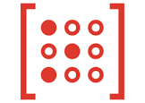
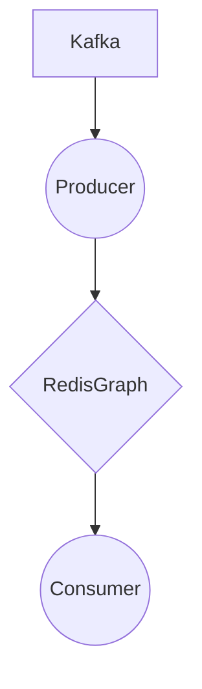

# Connect Kafka to RedisGraph

Quix helps you integrate Kafka to RedisGraph using pure Python.

<a class="md-button md-button--primary" href="https://share.hsforms.com/1iW0TmZzKQMChk0lxd_tGiw4yjw2?__hstc=175542013.2303933fbd746c0ac86d9ccbe9bc9100.1728383268831.1729603416735.1729620918855.31&__hssc=175542013.1.1729620918855&__hsfp=2132701734" target="_blank" style="margin-right:.5rem;">Book a demo</a>
 

## RedisGraph

RedisGraph is a technology that provides a graph database functionality within the Redis platform. It is designed to efficiently represent and query graph structured data, making it ideal for applications that require complex relationships between data points to be stored and analyzed. RedisGraph uses a property graph model, allowing users to define nodes and edges with attributes, and to query the graph using a query language similar to SQL. This technology is known for its high performance and scalability, making it well-suited for use cases in social networks, recommendation systems, fraud detection, and more. With RedisGraph, users can easily store and manipulate graph data in real-time, making it a powerful tool for data-driven applications.

## Integrations

Quix is a good fit for integrating with RedisGraph because of its comprehensive platform for developing, deploying, and managing real-time data pipelines. With features such as streamlined development and deployment, enhanced collaboration, real-time monitoring, and flexible scaling and management, Quix provides a robust infrastructure for handling data processing tasks.

In particular, the features of Quix Cloud such as real-time monitoring, data exploration, and visualization, and robust CI/CD processes align well with the capabilities of RedisGraph. RedisGraph is a graph database that allows for efficient querying and analysis of interconnected data, making it a valuable tool for applications that involve complex relationships and dependencies.

Additionally, Quix Streams, a cloud-native library for processing data in Kafka using Python, can complement the integration with RedisGraph by providing a user-friendly Python interface for working with Kafka data streams. The serialization and state management capabilities of Quix Streams, along with its support for time window aggregations and resilient scaling, make it a practical choice for handling data processing tasks in a RedisGraph integration scenario.

Overall, Quix's capabilities for streamlined development, real-time monitoring, and data exploration, coupled with Quix Streams' support for processing data in Kafka using Python, make it a suitable platform for integrating with RedisGraph and leveraging its graph database functionality effectively.

