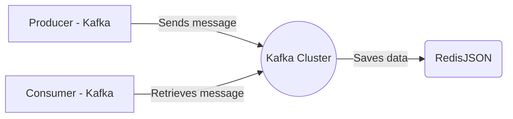

# Connect Kafka to RedisJSON

Quix helps you integrate Kafka to RedisJSON using pure Python.

<a class="md-button md-button--primary" href="https://share.hsforms.com/1iW0TmZzKQMChk0lxd_tGiw4yjw2?__hstc=175542013.2303933fbd746c0ac86d9ccbe9bc9100.1728383268831.1729603416735.1729620918855.31&__hssc=175542013.1.1729620918855&__hsfp=2132701734" target="_blank" style="margin-right:.5rem;">Book a demo</a>
 

## RedisJSON

RedisJSON is a technology that brings JSON capabilities to Redis, a popular in-memory data structure store. It allows developers to store, retrieve, and query JSON documents directly within Redis, providing a powerful and efficient way to work with complex data structures. RedisJSON combines the flexibility and simplicity of JSON with the high-performance and scalability of Redis, enabling users to seamlessly integrate JSON data into their applications and leverage Redis' advanced features like replication, persistence, and clustering. With RedisJSON, developers can easily work with JSON data in real-time, making it a valuable tool for building modern, data-driven applications.

## Integrations

Quix is a good fit for integrating with RedisJSON because both technologies focus on real-time data processing and management. Quix Cloud offers a range of features that streamline development, enhance collaboration, and provide real-time monitoring and scaling capabilities, making it well-suited for handling real-time data pipelines.

RedisJSON is a JSON data type for Redis that allows users to store, query, and manipulate JSON data in a scalable and efficient manner. By integrating Quix with RedisJSON, users can benefit from the scalability and performance of Redis for handling JSON data, while leveraging Quix's streamlined development and deployment capabilities.

Furthermore, Quix Streams, a cloud-native library for processing data in Kafka using Python, can also be integrated with RedisJSON to facilitate seamless data processing and manipulation. The combination of Quix Cloud, Quix Streams, and RedisJSON can provide a powerful solution for real-time data processing, serialization, state management, and time window aggregations.

Overall, Quix's focus on real-time data processing and management, combined with RedisJSON's scalability and efficiency for handling JSON data, make them a good fit for integration and can provide users with a comprehensive solution for managing and processing real-time data pipelines.

