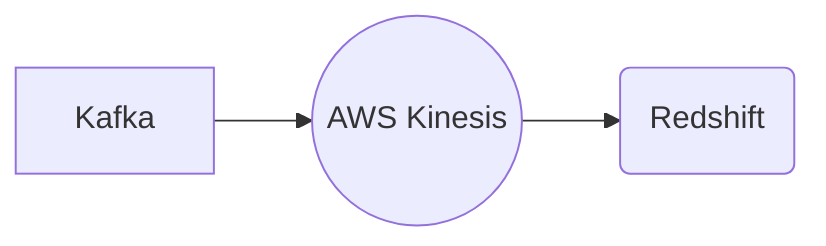

# Connect Kafka to Redshift

Quix helps you integrate Kafka to Redshift using pure Python.

## Redshift

Redshift is a powerful data warehousing technology developed by Amazon Web Services. It allows users to analyze vast amounts of data quickly and efficiently by utilizing a columnar storage format and parallel processing capabilities. Redshift is fully managed and scalable, making it easy for businesses to store and analyze petabytes of data without the need for complex infrastructure. Users can easily query and visualize their data using standard SQL statements and popular BI tools. Redshift is known for its speed, performance, and cost-effectiveness, making it a popular choice for organizations looking to harness the power of big data for their analytical needs.

## Integrations

Quix is a good fit for integrating with Redshift due to the following reasons:

1. Real-Time Data Processing: Quix Streams offers a cloud-native library for processing data in Kafka using Python, making it ideal for real-time data processing. This aligns well with Redshift, which is known for its high-performance query processing and analytical capabilities for large datasets.

2. Scalability: Both Quix Streams and Quix Cloud are designed for scalability, allowing users to easily scale resources, manage CPU and memory, and handle multiple environments. This complements Redshift's scalability, which can handle petabytes of data and thousands of concurrent queries.

3. Integration with Kafka: Quix Cloud supports integration with Kafka, including third-party Kafka solutions like Confluent Cloud and Redpanda. This makes it easy to ingest data from Kafka into Redshift for analysis and reporting.

4. Python Integration: Quix Streams works seamlessly with the Python ecosystem, allowing users to leverage popular libraries like Pandas, scikit-learn, and TensorFlow. This makes it easy to manipulate and process data before loading it into Redshift for further analysis.

5. Time Window Aggregations: Quix Streams supports aggregations over tumbling and hopping time windows, making it well-suited for time-series data processing. This complements Redshift's ability to handle complex analytical queries and time-based aggregations.

Overall, the combination of Quix with Redshift provides a powerful and flexible solution for processing, analyzing, and visualizing real-time data at scale.

