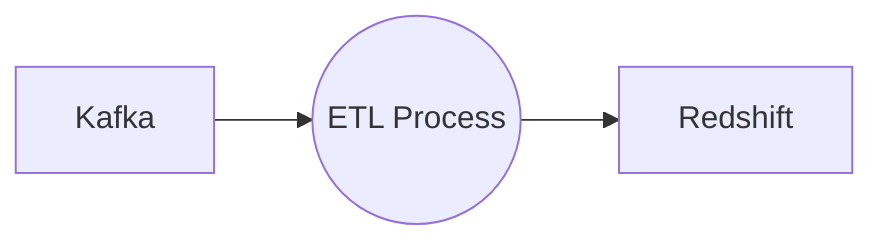

# Connect Kafka to Redshift

Quix helps you integrate Kafka to Redshift using pure Python.

- __Find out how we can help you integrate!__

    <a class="md-button md-button--primary" href="https://share.hsforms.com/1iW0TmZzKQMChk0lxd_tGiw4yjw2?__hstc=175542013.2303933fbd746c0ac86d9ccbe9bc9100.1728383268831.1729603416735.1729620918855.31&__hssc=175542013.1.1729620918855&__hsfp=2132701734" target="_blank" style="margin:.5rem;">Book a demo</a>

## Redshift

Redshift is a cloud-based data warehouse service provided by Amazon Web Services (AWS) that is designed for analytical queries on large datasets. It allows users to store and analyze large amounts of data quickly and efficiently. Redshift uses columnar storage, which organizes data by columns rather than by rows, allowing for faster query performance. It also utilizes massively parallel processing (MPP) architecture, which distributes queries across multiple nodes for improved performance and scalability. With its ease of use, low cost, and ability to handle petabytes of data, Redshift is a popular choice for organizations looking to analyze large volumes of data in real-time.

## Integrations

Quix is a good fit for integrating with Redshift because it offers a comprehensive platform for developing, deploying, and managing real-time data pipelines. With features such as streamlined development and deployment, enhanced collaboration, real-time monitoring, and flexible scaling and management, Quix provides the necessary tools to work efficiently with Redshift.

One of the key components of Quix, Kafka Integration, allows users to connect with third-party Kafka solutions, including Redpanda. This seamless integration enables users to easily ingest and process data in Kafka using Quix Streams, a cloud-native library specifically designed for processing data in Kafka using Python. Quix Streams eliminates the need for a JVM and provides a user-friendly Python interface, making it a perfect fit for working with Redshift.

Additionally, Quix offers robust CI/CD processes and development tools, including online code editors and code templates, to streamline the development and deployment of data pipelines. The platform also supports data exploration and visualization, allowing users to query and explore data in real-time, which is essential for managing and analyzing data in Redshift.

Overall, Quix's comprehensive features, flexibility, and integration capabilities make it a great choice for organizations looking to integrate with Redshift and streamline their data processing workflows.

