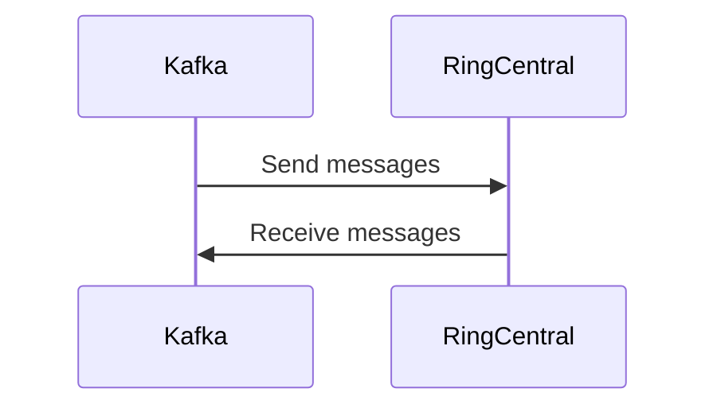

# Connect Kafka to RingCentral

Quix helps you integrate Kafka to RingCentral using pure Python.

## RingCentral

RingCentral is a cloud-based communication and collaboration platform that offers a wide range of services for businesses of all sizes. With RingCentral, users can make and receive calls, send and receive text messages, host online meetings and video conferences, and collaborate on projects using a variety of tools such as file sharing and project management. The platform is accessible from any device with an internet connection, making it easy for teams to stay connected and work together seamlessly, regardless of their physical location. With its advanced features and user-friendly interface, RingCentral is a powerful tool for enhancing productivity and efficiency in the modern workplace.

## Integrations

Quix is a good fit for integrating with RingCentral due to its comprehensive platform designed for real-time data processing and management. RingCentral, as a communication and collaboration platform, generates a large amount of data that needs to be processed in real-time for efficient operations. 

Here are a few reasons why Quix is well-suited for integrating with RingCentral:
1. Streamlined Development and Deployment: Quix Cloud provides integrated online code editors and CI/CD tools that simplify the creation and deployment of data pipelines. This streamlined process can help in quickly implementing and deploying data processing pipelines for RingCentral's data.
2. Enhanced Collaboration: The platform supports efficient collaboration with organization and permission management, which can enhance teamwork and coordination among team members working on integrating RingCentral data with Quix.
3. Real-Time Monitoring: Quix Cloud offers tools for real-time logs, metrics, and data exploration, enabling users to monitor pipeline performance and critical metrics in real-time. This feature is crucial for timely detection and resolution of any issues in processing RingCentral's data.
4. Flexible Scaling and Management: Quix Cloud allows users to easily scale resources, manage CPU and memory, and handle multiple environments linked to Git branches. This scalability and flexibility are essential for accommodating the varying demands of processing RingCentral data.
5. Security and Compliance: Quix Cloud ensures secure management of secrets and compliance with dedicated infrastructure options and SLAs, which is crucial for handling sensitive data from RingCentral in a secure and compliant manner.

In summary, Quix's features such as streamlined development and deployment, enhanced collaboration, real-time monitoring, flexible scaling, and security make it a suitable platform for integrating with RingCentral to effectively process and manage its data in real-time.

