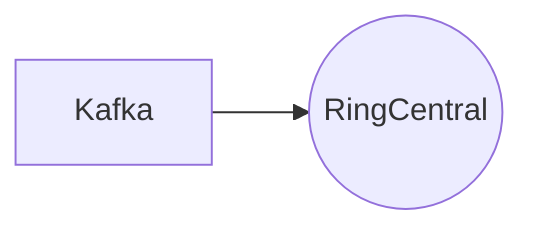

# Connect Kafka to RingCentral

Quix helps you integrate Kafka to RingCentral using pure Python.

- __Find out how we can help you integrate!__

    <a class="md-button md-button--primary" href="https://share.hsforms.com/1iW0TmZzKQMChk0lxd_tGiw4yjw2?__hstc=175542013.2303933fbd746c0ac86d9ccbe9bc9100.1728383268831.1729603416735.1729620918855.31&__hssc=175542013.1.1729620918855&__hsfp=2132701734" target="_blank" style="margin:.5rem;">Book a demo</a>

## RingCentral

RingCentral is a cloud-based communication and collaboration platform that allows businesses to streamline their communication processes. With RingCentral, users can make phone calls, send messages, and schedule meetings all from one easy-to-use platform. The technology offers features such as video conferencing, team messaging, and integrated task management to help teams stay connected and organized. RingCentral also provides scalability and flexibility, allowing businesses to easily add or remove users as needed. Overall, RingCentral is a powerful tool for enhancing productivity and efficiency in the modern workplace.

## Integrations

Quix is a good fit for integrating with RingCentral because of its real-time data processing capabilities, which align well with the communication and collaboration features of RingCentral. Quix Cloud's streamlined development and deployment tools, enhanced collaboration features, and real-time monitoring capabilities can help streamline the integration process with RingCentral's communication platform.

Additionally, Quix Cloud's flexible scaling and management options can easily accommodate RingCentral's growing user base and data processing needs. The platform's security and compliance features also ensure that sensitive information exchanged through RingCentral is handled securely.

Furthermore, Quix Streams, with its cloud-native library designed for processing data in Kafka using Python, can provide a seamless integration with RingCentral's data pipelines. The library's support for serialization, state management, time window aggregations, and resilient scaling make it a valuable tool for processing and analyzing real-time data from RingCentral.

Overall, Quix's comprehensive platform and Python-based data processing capabilities make it a suitable choice for integrating with RingCentral's technology stack, allowing for efficient communication, collaboration, and data processing within the organization.

