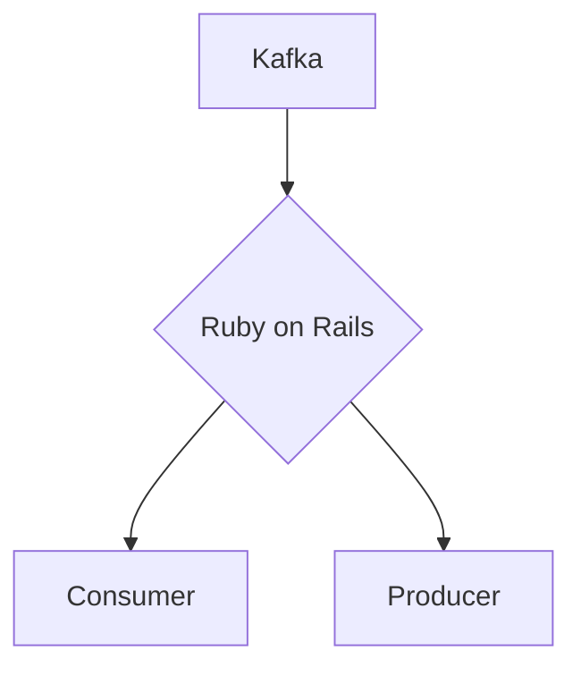

# Connect Kafka to Ruby on Rails

Quix helps you integrate Kafka to Ruby on Rails using pure Python.

## Ruby on Rails

Ruby on Rails, often shortened to Rails, is a web application framework written in the Ruby programming language. It follows the model-view-controller (MVC) pattern and provides developers with a variety of tools and libraries to streamline the development process. Rails emphasizes convention over configuration, allowing developers to quickly build and deploy robust web applications with minimal configuration. It also includes features such as automated testing, code generation, and scaffolding to speed up development. Known for its simplicity and readability, Ruby on Rails is a popular choice for startups and small businesses looking to create dynamic and scalable web applications.

## Integrations

Quix is a good fit for integrating with Ruby on Rails because of several factors. 

1. Seamless Integration: Ruby on Rails is a popular web development framework that allows for rapid application development. Quix can seamlessly integrate with Ruby on Rails applications, providing developers with a comprehensive platform for real-time data processing.

2. Enhanced Collaboration: The collaboration features of Quix Cloud, such as organization and permission management, can help Ruby on Rails developers work more efficiently on data pipeline projects. This increased collaboration can lead to faster development and deployment of data pipelines within Ruby on Rails applications.

3. Real-Time Monitoring: Quix Cloud's real-time monitoring tools can be invaluable for Ruby on Rails developers, allowing them to monitor pipeline performance and critical metrics in real-time. This can help developers quickly identify and address any issues that may arise during the development and deployment of data pipelines within Ruby on Rails applications.

4. Flexible Scaling and Management: Quix Cloud's flexible scaling and management capabilities are well-suited for the dynamic nature of Ruby on Rails applications. Developers can easily scale resources, manage CPU and memory usage, and handle multiple environments linked to Git branches, providing greater control and flexibility during the development and deployment of data pipelines within Ruby on Rails applications.

5. Security and Compliance: Quix Cloud's secure management of secrets and compliance options make it a reliable choice for integrating with Ruby on Rails applications that require robust security measures. This ensures that sensitive data is handled securely and that compliance requirements are met.

Overall, Quix provides a powerful platform for developing, deploying, and managing real-time data pipelines, making it a good fit for integrating with Ruby on Rails applications that require efficient and scalable data processing capabilities.

