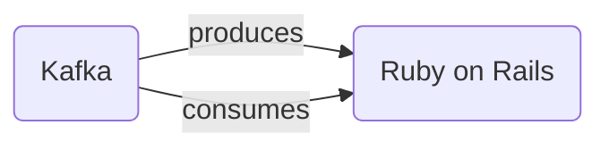

# Connect Kafka to Ruby on Rails

Quix helps you integrate Kafka to Ruby on Rails using pure Python.

<a class="md-button md-button--primary" href="https://share.hsforms.com/1iW0TmZzKQMChk0lxd_tGiw4yjw2?__hstc=175542013.2303933fbd746c0ac86d9ccbe9bc9100.1728383268831.1729603416735.1729620918855.31&__hssc=175542013.1.1729620918855&__hsfp=2132701734" target="_blank" style="margin-right:.5rem;">Book a demo</a>
 

## Ruby on Rails

Ruby on Rails is a popular web application framework written in the Ruby programming language. It is designed to make web development faster and easier by providing a set of tools and conventions for building robust and scalable applications. Ruby on Rails emphasizes convention over configuration, meaning that developers can quickly get started with building their applications without needing to spend time configuring settings. It also follows the Model-View-Controller (MVC) architectural pattern, which helps to keep code organized and maintainable. Overall, Ruby on Rails is known for its simplicity, flexibility, and productivity, making it a favorite among developers for building modern web applications.

## Integrations

Quix is a good fit for integrating with Ruby on Rails due to its comprehensive features that streamline development, enhance collaboration, and provide real-time monitoring and scaling capabilities. Ruby on Rails is known for its simplicity, elegance, and productivity, making it an ideal choice for rapid web application development. Quix's integrated online code editors, CI/CD tools, and YAML synchronization align well with Ruby on Rails' development workflow, enabling developers to easily create and deploy data pipelines.

Additionally, Quix's support for organization and permission management enhances collaboration, which is essential for team-based Ruby on Rails projects. Real-time monitoring tools provided by Quix Cloud allow developers to monitor the performance of their pipelines and ensure everything is running smoothly. The flexible scaling and management capabilities of Quix Cloud also align well with Ruby on Rails applications, allowing developers to easily scale resources as needed.

Furthermore, Quix's support for DevContainers, online code editors, and connectors for various data sources and sinks complements the development tools commonly used in Ruby on Rails projects. The platform's integration with Git providers like GitHub and Bitbucket facilitates seamless CI/CD processes, which is crucial for deploying Ruby on Rails applications.

In addition, Quix Streams, a cloud-native library for processing data in Kafka using Python, can be a valuable asset when integrating with Ruby on Rails. With its support for serialization formats, time window aggregations, and container orchestration, Quix Streams can enhance the data processing capabilities of Ruby on Rails applications. Overall, Quix's features align well with the needs of Ruby on Rails developers, making it a good fit for integrating with this technology.

