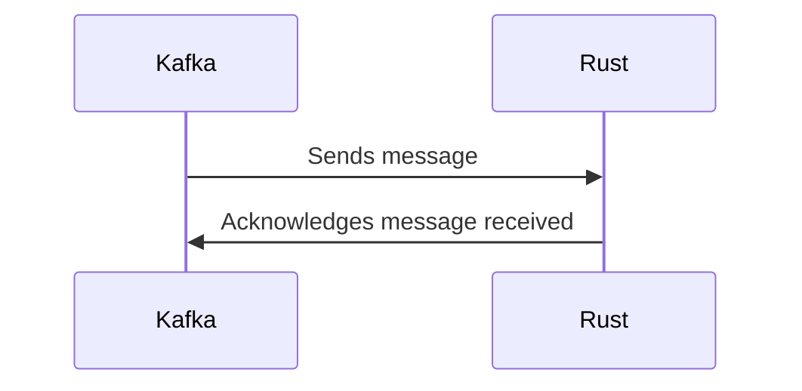

# Connect Kafka to Rust

Quix helps you integrate Kafka to Rust using pure Python.

## Rust

Rust is a systems programming language that focuses on safety, speed, and concurrency. Developed by Mozilla, Rust is designed to prevent common programming errors such as null pointer dereferencing, buffer overflows, and memory leaks. Its unique ownership system allows for memory safety without the need for a garbage collector, making it suitable for low-level programming tasks. Rust also boasts a rich ecosystem of libraries and tools that make it easier for developers to build robust and efficient software. Overall, Rust is a powerful and versatile technology that is gaining popularity among developers for its reliability and performance.

## Integrations

Quix would be a good fit for integrating with Rust due to the following reasons:

1. Streamlined Development and Deployment: Rust is known for its performance, reliability, and memory safety features, making it a popular choice for developing high-performance applications. With Quix Cloud's integrated online code editors and CI/CD tools, developers can easily write and deploy Rust-based applications for real-time data processing.

2. Enhanced Collaboration: Quix Cloud's organization and permission management features ensure efficient collaboration among team members working on Rust-based projects. This enhances project visibility and control, leading to better teamwork and productivity.

3. Real-Time Monitoring: Rust applications integrated with Quix Cloud can take advantage of the platform's real-time monitoring tools for logs, metrics, and data exploration. This allows developers to monitor the performance of their Rust applications in real-time and make necessary adjustments for optimal efficiency.

4. Flexible Scaling and Management: Rust applications can easily scale resources and manage CPU and memory usage with Quix Cloud. This enables seamless handling of multiple environments and Git branches, allowing for smooth scaling of Rust-based data pipelines.

5. Security and Compliance: Quix Cloud ensures secure management of secrets and compliance with dedicated infrastructure options, making it a secure platform for deploying Rust applications. This is crucial for maintaining data security and compliance with industry regulations.

Overall, the combination of Rust's performance and reliability with Quix Cloud's features for development, collaboration, monitoring, scaling, and security makes it a strong choice for integrating Rust with real-time data pipelines. This integration can lead to efficient and reliable data processing solutions for various use cases.

