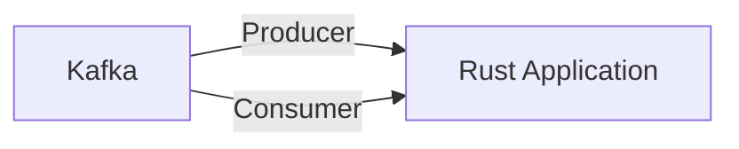

# Connect Kafka to Rust

Quix helps you integrate Kafka to Rust using pure Python.

<a class="md-button md-button--primary" href="https://share.hsforms.com/1iW0TmZzKQMChk0lxd_tGiw4yjw2?__hstc=175542013.2303933fbd746c0ac86d9ccbe9bc9100.1728383268831.1729603416735.1729620918855.31&__hssc=175542013.1.1729620918855&__hsfp=2132701734" target="_blank" style="margin-right:.5rem;">Book a demo</a>
 

## Rust

Rust is a modern, statically typed programming language that focuses on performance, safety, and concurrency. It was developed by Mozilla Research and designed to be a systems programming language, ideal for building highly reliable and efficient software. Rust achieves safety by incorporating strict compile-time checks that catch common programming errors, such as null dereferencing and race conditions. It also features a sophisticated ownership system that ensures memory safety without the need for a garbage collector. Additionally, Rust has built-in support for parallelism and asynchronous programming, making it a powerful tool for creating scalable and high-performance applications. Overall, Rust is a versatile and robust technology that is gaining popularity among developers for its ability to deliver fast and secure software solutions.

## Integrations

Rust is a systems programming language known for its performance, reliability, and memory safety features. It is often used for building highly concurrent and asynchronous applications, making it a good fit for integrating with Quix Cloud, which focuses on developing real-time data pipelines. Here are some reasons why Quix is a good fit for integrating with Rust:

1. Performance: Rust's focus on zero-cost abstractions and fine-grained control over resource management makes it well-suited for building high-performance applications. Quix Cloud, being a platform for real-time data processing, can benefit from Rust's performance optimizations to ensure efficient data pipeline execution.

2. Memory Safety: Rust's strict compile-time checks and ownership model prevent common bugs such as null pointer dereferencing and memory leaks. This can be crucial for developing reliable and robust data pipelines in Quix Cloud, where data consistency and reliability are paramount.

3. Concurrency and Asynchrony: Rust's support for asynchronous programming through features like async/await and lightweight threads (called "tasks") can be advantageous for building highly concurrent data pipelines in Quix Cloud. This can help in efficiently handling large volumes of data streams and processing tasks concurrently.

4. Ecosystem Compatibility: Rust has a growing ecosystem of libraries and tools that can complement Quix Cloud's functionality. For example, Rust libraries like tokio and actix can be used for building asynchronous, event-driven applications, which align well with the real-time data processing capabilities of Quix Cloud.

5. Modern Tooling: Rust has a modern toolchain with features like cargo (package manager), rustfmt (formatter), and rustdoc (documentation tool) that can streamline development workflows in Quix Cloud. Integration with CI/CD tools and IDEs can further enhance the development and deployment experience.

In conclusion, the performance, reliability, and concurrency features of Rust make it a good fit for integrating with Quix Cloud, a platform designed for real-time data pipeline development and management. By leveraging Rust's capabilities, developers can build efficient, scalable, and reliable data pipelines on Quix Cloud, ensuring optimal performance and data processing capabilities.

