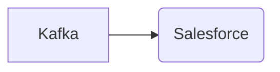

# Connect Kafka to Salesforce

Quix helps you integrate Kafka to Salesforce using pure Python.

## Salesforce

Salesforce is a cloud-based customer relationship management (CRM) software that helps businesses manage their customer interactions and improve their overall customer experience. It offers a range of tools and features that enable companies to streamline their sales, marketing, and customer service processes, providing a centralized platform for managing leads, customer data, and communication channels. Salesforce is highly customizable, allowing businesses to tailor the software to their specific needs and requirements. With its intuitive interface and robust analytics capabilities, Salesforce helps companies drive growth, increase productivity, and build lasting relationships with their customers.

## Integrations

Quix is a good fit for integrating with Salesforce due to its comprehensive features and capabilities that align well with the needs of Salesforce users. 

1. Streamlined Development and Deployment: Quix Cloud's integrated online code editors and CI/CD tools make it easy to create and deploy data pipelines, which can be beneficial for Salesforce developers looking to streamline their development processes.

2. Real-Time Monitoring: Salesforce users can benefit from Quix Cloud's real-time monitoring tools to track pipeline performance and critical metrics, ensuring timely insights and decision-making.

3. Flexible Scaling and Management: Quix Cloud's ability to easily scale resources and manage CPU and memory can support the dynamic data processing needs of Salesforce applications.

4. Security and Compliance: With dedicated infrastructure options and secure management of secrets, Quix Cloud can help ensure data security and compliance for Salesforce integrations.

5. Kafka Integration: Quix Cloud's support for Kafka integration can be valuable for Salesforce users who need to process data in real-time and leverage Kafka's scalability for efficient data processing.

6. Data Exploration and Visualization: The ability to query, explore, and visualize data in real-time using Quix Cloud can enhance the data analysis capabilities of Salesforce users.

7. Python Ecosystem Integration: Salesforce developers who work with Python libraries like Pandas and scikit-learn can benefit from Quix Streams' compatibility with the Python ecosystem, facilitating seamless integration and data processing.

In summary, the features of Quix Cloud and Quix Streams make them well-suited for integrating with Salesforce by providing efficient development, monitoring, scaling, security, and data processing capabilities that can enhance Salesforce applications and workflows.

