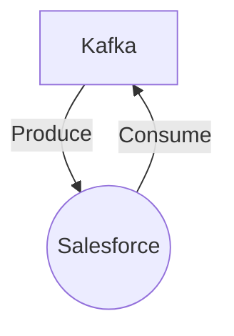

# Connect Kafka to Salesforce

Quix helps you integrate Kafka to Salesforce using pure Python.

- __Find out how we can help you integrate!__

    <a class="md-button md-button--primary" href="https://share.hsforms.com/1iW0TmZzKQMChk0lxd_tGiw4yjw2?__hstc=175542013.2303933fbd746c0ac86d9ccbe9bc9100.1728383268831.1729603416735.1729620918855.31&__hssc=175542013.1.1729620918855&__hsfp=2132701734" target="_blank" style="margin:.5rem;">Book a demo</a>

## Salesforce

Salesforce is a cloud-based software platform that offers a wide range of customer relationship management (CRM) tools and capabilities for businesses of all sizes. It allows organizations to manage their customer information, track interactions, and automate various sales and marketing processes. Salesforce also provides analytics and reporting tools to help businesses gain insights into their customer base and make informed decisions. With its highly customizable features and seamless integration with other software applications, Salesforce has revolutionized how companies interact with their customers and manage their sales pipelines. Its user-friendly interface and extensive customer support make it a popular choice for companies looking to streamline their operations and drive growth.

## Integrations

Quix is a good fit for integrating with Salesforce because of its comprehensive platform designed for developing, deploying, and managing real-time data pipelines. 

1. Streamlined Development and Deployment: Quix's integrated online code editors and CI/CD tools simplify the creation and deployment of data pipelines, which can be beneficial for integrating with Salesforce APIs and data sources.

2. Enhanced Collaboration: Quix supports efficient collaboration with organization and permission management, increasing project visibility and control, which is important when working on projects involving Salesforce integration with multiple team members.

3. Real-Time Monitoring: Quix Cloud provides tools for real-time logs, metrics, and data exploration, allowing users to monitor pipeline performance and critical metrics, which is crucial for ensuring the smooth operation of Salesforce integrations.

4. Flexible Scaling and Management: Users can easily scale resources, manage CPU and memory, and handle multiple environments linked to Git branches, which can help in efficiently managing and scaling Salesforce integrations as per the needs of the business.

5. Security and Compliance: Quix ensures secure management of secrets and compliance with dedicated infrastructure options and SLAs, which is vital for maintaining data security and regulatory compliance when working with Salesforce data.

6. Development Tools: Quix includes online code editors, code templates, and connectors for various data sources and sinks, supporting DevContainers for enhanced workflows, which can aid developers in efficiently building and customizing Salesforce integrations.

In addition, Quix Streams, a cloud-native library for processing data in Kafka using Python, can further enhance the integration capabilities with Salesforce by providing features such as serialization and state management, time window aggregations, and resilient scaling, all of which are essential for handling and processing Salesforce data efficiently. Overall, Quix's features make it a suitable platform for integrating with Salesforce and leveraging its powerful capabilities for real-time data processing and management.

