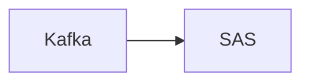

# Connect Kafka to SAS

Quix helps you integrate Kafka to SAS using pure Python.

## SAS

SAS, or Statistical Analysis System, is a software suite developed by SAS Institute for advanced analytics, data management, and business intelligence. It is a powerful tool used by organizations to analyze, manage, and visualize large amounts of data to make informed decisions and drive business growth. SAS offers a wide range of features such as data mining, statistical analysis, predictive modeling, and machine learning capabilities. Users can easily access and manipulate data, create reports and graphical representations, and generate insights to solve complex business problems. With its user-friendly interface and robust functionality, SAS has become one of the leading tools in the field of data analytics and is widely used across industries worldwide.

## Integrations

Quix is a good fit for integrating with SAS technology because it offers a comprehensive platform for developing, deploying, and managing real-time data pipelines. SAS is a powerful analytics platform that processes data in real-time, and by integrating with Quix Cloud, users can leverage its streamlined development and deployment capabilities to create and deploy data pipelines efficiently.

Quix Cloud also provides enhanced collaboration features, such as organization and permission management, which can improve project visibility and control when working with SAS technology. Additionally, the platform offers real-time monitoring tools for tracking pipeline performance and critical metrics, which is essential for ensuring the reliability and accuracy of data processed by SAS.

Furthermore, Quix Cloud's flexible scaling and management options, as well as its security and compliance measures, make it a suitable choice for integrating with SAS technology. With features like dedicated infrastructure options, secure management of secrets, and compliance with SLAs, users can trust that their data processing workflows are secure and compliant.

Overall, the development tools, data exploration and visualization capabilities, and robust CI/CD processes offered by Quix Cloud make it a valuable asset for integrating with SAS technology, allowing users to streamline their data processing workflows and enhance the capabilities of SAS analytics. Additionally, Quix Streams' cloud-native library for processing data in Kafka using Python can complement SAS technology by providing a user-friendly interface for data processing and analytics operations.

