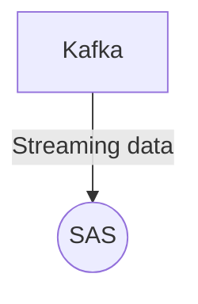

# Connect Kafka to SAS

Quix helps you integrate Kafka to SAS using pure Python.

<a class="md-button md-button--primary" href="https://share.hsforms.com/1iW0TmZzKQMChk0lxd_tGiw4yjw2?__hstc=175542013.2303933fbd746c0ac86d9ccbe9bc9100.1728383268831.1729603416735.1729620918855.31&__hssc=175542013.1.1729620918855&__hsfp=2132701734" target="_blank" style="margin-right:.5rem;">Book a demo</a>
 

## SAS

SAS, which stands for Statistical Analysis System, is a software suite developed by SAS Institute for advanced analytics, business intelligence, and data management. The technology allows users to perform data mining, statistical analysis, and predictive modeling to uncover insights and trends within data sets. SAS is widely used in industries such as finance, healthcare, and government for tasks such as fraud detection, risk management, and forecasting. With its powerful capabilities and user-friendly interface, SAS has become a go-to tool for organizations looking to harness the power of their data to make informed decisions and drive business growth.

## Integrations

Quix is a good fit for integrating with SAS technology because it offers a comprehensive platform for developing, deploying, and managing real-time data pipelines. SAS is known for its powerful analytics and data management capabilities, and integrating with Quix can further enhance these features by providing streamlined development and deployment tools, enhanced collaboration capabilities, real-time monitoring and scaling options, and secure management of secrets.

With Quix's Streamlined Development and Deployment features, users can easily create and deploy data pipelines using integrated online code editors and CI/CD tools. This can help streamline the development process and ensure efficient deployment of analytics models and data processing pipelines within SAS.

Enhanced Collaboration features in Quix allow for efficient teamwork and organization management, providing increased visibility and control over projects. This can improve collaboration within the SAS environment and facilitate easier communication and project management among team members.

Real-Time Monitoring tools in Quix Cloud enable users to monitor pipeline performance and critical metrics in real-time. This can be beneficial for SAS users who require immediate feedback on their analytics models and data pipelines, allowing them to make quick adjustments and optimizations as needed.

Flexible Scaling and Management options in Quix Cloud make it easy for users to scale resources, manage CPU and memory, and handle multiple environments linked to Git branches. This can be especially useful for SAS users who need to efficiently manage and scale their infrastructure based on changing data processing requirements.

Overall, the integration of Quix with SAS technology can bring added efficiency, collaboration, and monitoring capabilities to users, enhancing their overall data analytics and management workflows.

