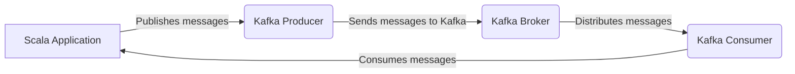

# Connect Kafka to Scala

Quix helps you integrate Kafka to Scala using pure Python.

## Scala

Scala is a statically typed programming language that blends functional and object-oriented programming paradigms. Developed in 2003, Scala is designed to be highly expressive and scalable, making it a popular choice for building complex and reliable systems. It runs on the Java Virtual Machine, allowing for seamless interoperability with existing Java code. Scala's powerful features such as pattern matching, higher-order functions, and type inference make it a flexible and efficient language for a wide range of applications. Its concise syntax and strong static typing help developers write cleaner and more maintainable code. Overall, Scala is a versatile and powerful technology that offers a unique combination of modern language features and compatibility with the Java ecosystem.

## Integrations

Quix is a good fit for integrating with Scala technology due to the following reasons:

1. Streamlined Development: Both Quix Streams and Quix Cloud offer tools and features that simplify the development and deployment of data pipelines. This can be beneficial for Scala developers looking to quickly build and deploy real-time data processing applications.

2. Enhanced Collaboration: The collaboration features provided by Quix Cloud, such as organization and permission management, can help Scala developers work efficiently in a team environment. This can lead to better project visibility and control.

3. Real-Time Monitoring: Scala developers can benefit from the real-time monitoring tools provided by Quix Cloud, which allow for monitoring pipeline performance and critical metrics. This can help in identifying and addressing issues proactively.

4. Flexible Scaling and Management: Quix Cloud offers flexible scaling options and management capabilities, which can be useful for Scala developers looking to efficiently manage resources and handle multiple environments. This can help in optimizing performance and scalability of Scala applications.

5. Development Tools: Quix Cloud includes development tools such as online code editors and code templates, which can enhance the development workflows of Scala developers. Integration with Git providers also facilitates seamless CI/CD processes.

6. Kafka Integration: Both Quix Streams and Quix Cloud support Kafka integration, which can be beneficial for Scala developers working with Kafka for data processing. This seamless integration can simplify the development and deployment of Scala applications using Kafka.

Overall, the features and capabilities offered by Quix make it a suitable choice for integrating with Scala technology, providing Scala developers with a comprehensive platform for developing, deploying, and managing real-time data pipelines.

