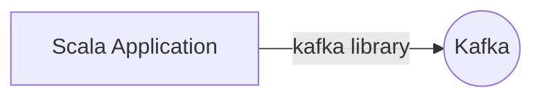

# Connect Kafka to Scala

Quix helps you integrate Kafka to Scala using pure Python.

<a class="md-button md-button--primary" href="https://share.hsforms.com/1iW0TmZzKQMChk0lxd_tGiw4yjw2?__hstc=175542013.2303933fbd746c0ac86d9ccbe9bc9100.1728383268831.1729603416735.1729620918855.31&__hssc=175542013.1.1729620918855&__hsfp=2132701734" target="_blank" style="margin-right:.5rem;">Book a demo</a>
 

## Scala

Scala is a high-level programming language that combines object-oriented and functional programming paradigms. It is designed to be concise, expressive, and type-safe, making it a popular choice for building scalable and maintainable applications. Scala runs on the Java Virtual Machine (JVM), allowing it to seamlessly integrate with existing Java libraries and frameworks. It also offers advanced features such as pattern matching, immutability, and higher-order functions, giving developers the flexibility and power to write elegant and efficient code. Overall, Scala is a versatile and powerful technology that is well-suited for a wide range of applications, from small scripts to large-scale distributed systems.

## Integrations

Quix is a good fit for integrating with Scala technology because Scala is a powerful programming language that is known for its scalability, performance, and concurrency support. Quix Cloud, with its comprehensive platform for developing, deploying, and managing real-time data pipelines, complements Scala's strengths by providing features such as streamlined development and deployment, enhanced collaboration, real-time monitoring, flexible scaling and management, security and compliance, development tools, data exploration and visualization, robust CI/CD processes, and Kafka integration.

Additionally, Quix Streams, a cloud-native library for processing data in Kafka using Python, can also be easily integrated with Scala technology. This integration allows for seamless interoperability between Scala and Python, leveraging the strengths of both languages for developing efficient data processing pipelines. Furthermore, Quix Streams' features such as no JVM required, Python ecosystem integration, serialization and state management, time window aggregations, resilient scaling, and local and Jupyter Notebook support make it a valuable addition to the Scala ecosystem.

Overall, the combination of Quix Cloud's platform and Quix Streams library makes it an excellent choice for integrating with Scala technology, providing developers with a robust and efficient solution for building and managing real-time data pipelines.

