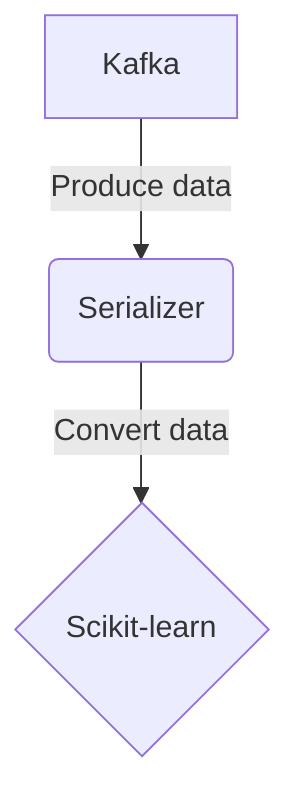

# Connect Kafka to Scikit-learn

Quix helps you integrate Kafka to Scikit-learn using pure Python.

## Scikit-learn

Scikit-learn is a popular open-source machine learning library that is built on top of NumPy, SciPy, and Matplotlib. It is designed to be user-friendly and efficient, making it easy for developers to implement various machine learning algorithms in Python. Scikit-learn provides a wide range of tools and functionalities for tasks such as classification, regression, clustering, dimensionality reduction, and model selection. It also offers various optimization techniques and preprocessing tools to help users clean and format their data before feeding it into the machine learning algorithms. With its extensive documentation and active community support, Scikit-learn has become one of the go-to libraries for machine learning practitioners of all skill levels.

## Integrations

Scikit-learn is a popular machine learning library in Python that offers a wide range of algorithms for data analysis and model building. Integrating Scikit-learn with Quix can be highly beneficial due to several reasons:

1. Seamless Python Integration: Both Quix Streams and Quix Cloud provide a user-friendly Python interface, making it easy to integrate with Scikit-learn without the need for complex setups or additional configurations.

2. Scalability and Real-Time Processing: Quix Streams is designed for processing data in Kafka, a highly scalable and distributed streaming platform. By integrating Scikit-learn with Quix Streams, you can leverage Kafka's scalability for real-time model training and inference, making it suitable for handling large volumes of data in production environments.

3. Streamlined Development and Deployment: Quix Cloud's streamlined development and deployment features, such as online code editors, CI/CD tools, and YAML synchronization, can simplify the process of building and deploying machine learning models using Scikit-learn. This can help accelerate the development cycle and improve collaboration among team members.

4. Real-Time Monitoring and Scaling: Quix Cloud's real-time monitoring and scaling capabilities allow you to monitor the performance of your machine learning models in real-time and easily scale resources as needed. This can help ensure optimal performance and reliability of your models when deployed in production environments.

5. Data Exploration and Visualization: Quix Cloud's data exploration and visualization tools can enhance your data analysis workflow when using Scikit-learn. You can query and explore data, visualize metrics, and gain insights into your model's performance in real-time, helping you make informed decisions and adjustments to your models.

By integrating Scikit-learn with Quix, you can leverage the scalability, ease-of-use, and monitoring capabilities of these platforms to build and deploy machine learning models efficiently and effectively in real-time data pipelines.

