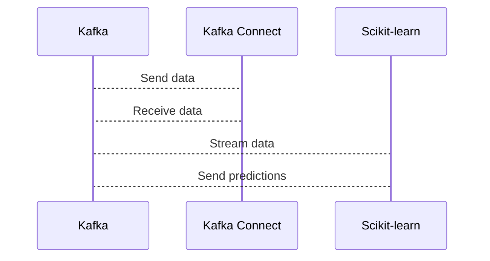

# Connect Kafka to Scikit-learn

Quix helps you integrate Kafka to Scikit-learn using pure Python.

- __Find out how we can help you integrate!__

    <a class="md-button md-button--primary" href="https://share.hsforms.com/1iW0TmZzKQMChk0lxd_tGiw4yjw2?__hstc=175542013.2303933fbd746c0ac86d9ccbe9bc9100.1728383268831.1729603416735.1729620918855.31&__hssc=175542013.1.1729620918855&__hsfp=2132701734" target="_blank" style="margin:.5rem;">Book a demo</a>

Here is a diagram of integrating Kafka with Scikit-learn:

## Scikit-learn

Scikit-learn is a popular machine learning library for Python that provides a wide range of tools for data analysis and predictive modeling. It is built on top of other popular libraries such as NumPy, SciPy, and Matplotlib, making it easy to integrate into existing workflows. With Scikit-learn, users can implement a variety of machine learning algorithms, including classification, regression, clustering, and dimensionality reduction. The library also offers tools for model evaluation, parameter tuning, and feature selection, making it a comprehensive solution for machine learning tasks. Additionally, Scikit-learn is well-documented and actively maintained, making it a reliable choice for both beginners and experienced users in the field of machine learning.

## Integrations

Quix is a good fit for integrating with Scikit-learn because it provides a platform designed specifically for developing, deploying, and managing real-time data pipelines. With features such as streamlined development and deployment, enhanced collaboration, real-time monitoring, and flexible scaling and management, Quix offers a robust environment for incorporating machine learning models into data pipelines.

The integration of Scikit-learn with Quix Streams, a cloud-native library for processing data in Kafka using Python, allows for seamless integration with Python libraries like Pandas, TensorFlow, and PyTorch. This compatibility with Python ecosystems makes it easy to leverage machine learning algorithms within Quix pipelines.

Furthermore, Quix Streams provides serialization and state management options, time window aggregations, and resilient scaling capabilities, all of which are essential for processing and analyzing data in real-time. With support for local and Jupyter notebook development, developers can easily test and debug machine learning models before deploying them in production.

Overall, the combination of Quix's comprehensive platform and Quix Streams' capabilities make it a great fit for integrating with Scikit-learn, enabling efficient and scalable deployment of machine learning models in real-time data pipelines.

