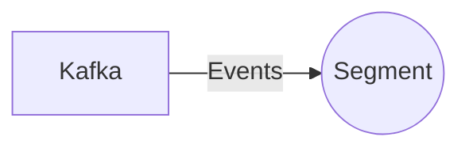

# Connect Kafka to Segment

Quix helps you integrate Kafka to Segment using pure Python.

## Segment

Segment is a customer data platform that allows companies to collect, clean, and organize their customer data from various sources into one centralized location. This technology enables businesses to have a unified view of their customers, helping them make data-driven decisions and provide personalized experiences. Segment also offers tools for data analysis and segmentation, giving companies the ability to target specific customer groups with tailored marketing campaigns. With its robust infrastructure and advanced capabilities, Segment is a valuable tool for businesses looking to streamline their data management processes and improve their customer relationships.

## Integrations

Quix would be a good fit for integrating with Segment due to its flexibility, scalability, and ease of use in real-time data processing. 

1. Integration with Kafka: Quix Streams, being a cloud-native library for processing data in Kafka using Python, can easily integrate with Segment, which is a popular tool for collecting customer data from various sources. The integration would allow for seamless data processing and analysis in real-time, enabling organizations to make quick and informed decisions based on their customer data.

2. Seamless Python Integration: Quix Streams utilizes Python, which is a widely-used programming language in the data science and analytics space. This aligns well with Segment's user-friendly interface, making it easy for data scientists and analysts to work with both platforms simultaneously.

3. Scalability and Real-Time Monitoring: Quix Cloud offers flexible scaling options and real-time monitoring capabilities, allowing organizations to efficiently manage their data pipelines and ensure high performance. This is crucial for handling the large volumes of data that Segment collects and processes on a regular basis.

4. Development Tools and Collaboration: Both Quix Cloud and Quix Streams provide robust development tools and collaboration features, enabling teams to work together seamlessly on data projects. This would be beneficial for organizations looking to integrate Segment with their existing data infrastructure and workflows.

Overall, the combination of Quix with Segment would enable organizations to leverage the power of real-time data processing and analytics, leading to improved decision-making and better customer insights.

