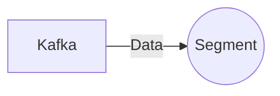

# Connect Kafka to Segment

Quix helps you integrate Kafka to Segment using pure Python.

<a class="md-button md-button--primary" href="https://share.hsforms.com/1iW0TmZzKQMChk0lxd_tGiw4yjw2?__hstc=175542013.2303933fbd746c0ac86d9ccbe9bc9100.1728383268831.1729603416735.1729620918855.31&__hssc=175542013.1.1729620918855&__hsfp=2132701734" target="_blank" style="margin-right:.5rem;">Book a demo</a>
 

## Segment

Segment is a customer data platform that helps companies collect, clean, and organize their customer data in one centralized location. This technology allows businesses to easily integrate data from various sources, such as websites, mobile apps, and CRMs, to create a comprehensive view of their customers. Segment offers a user-friendly interface and powerful tools that enable companies to analyze and leverage their customer data for more targeted marketing campaigns, personalized customer experiences, and improved overall business performance. With Segment, businesses can strategically harness the power of their data to drive growth and make more informed business decisions.

## Integrations

Quix is a good fit for integrating with Segment because it offers a comprehensive platform for developing, deploying, and managing real-time data pipelines. With Quix's streamlined development and deployment capabilities, users can easily create and deploy data pipelines with integrated online code editors and CI/CD tools. This aligns well with Segment's focus on simplifying data collection and integration processes.

Additionally, Quix's enhanced collaboration features, real-time monitoring tools, and flexible scaling and management capabilities make it easier for teams to work together efficiently and monitor pipeline performance in real-time. The platform's security and compliance measures also ensure that data is managed securely and in accordance with regulations.

Specifically, Quix Streams, a cloud-native library for processing data in Kafka using Python, complements Segment's capabilities by offering a user-friendly Python interface for working with Kafka data. The library's support for serialization, time window aggregations, and resilient scaling aligns well with the requirements for processing real-time data in Segment.

Overall, the integration of Quix with Segment can enhance the efficiency and effectiveness of data pipeline development and management, enabling organizations to collect, integrate, and analyze data more effectively.

