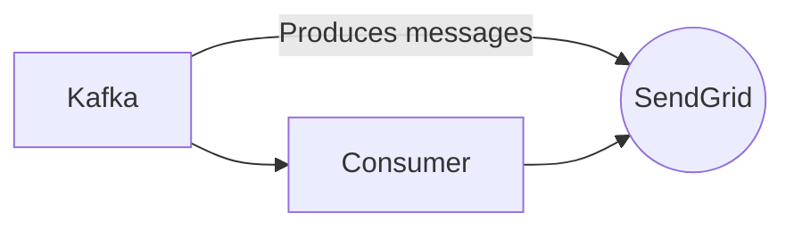

# Connect Kafka to SendGrid

Quix helps you integrate Kafka to SendGrid using pure Python.

## SendGrid

SendGrid is a cloud-based email platform that provides businesses with a reliable and scalable solution for sending marketing emails, transactional emails, and other types of email communications. The platform offers a variety of features, including email tracking, delivery optimization, and email templates, making it easy for businesses to create and send professional-looking emails to their customers. SendGrid also provides detailed analytics and reporting tools, allowing businesses to track the performance of their email campaigns and make data-driven decisions to improve their email marketing efforts. With its user-friendly interface and robust set of features, SendGrid is a popular choice for businesses looking to streamline their email marketing processes and improve their email deliverability rates.

## Integrations

SendGrid is a popular email delivery service that allows users to send transactional and marketing emails. By integrating SendGrid with Quix, users can enhance their data pipelines by incorporating email notifications, alerts, and reports into their workflows.

The real-time monitoring capabilities of Quix Cloud can be leveraged to send email alerts based on specific pipeline performance metrics or thresholds. For example, if there is a sudden increase in errors or delays in processing data, users can set up alerts through SendGrid to notify relevant team members immediately.

Additionally, the flexible scaling and management features of Quix Cloud are beneficial for handling large volumes of email notifications. As data pipelines scale up, the platform can automatically adjust the resources needed to send out email notifications efficiently through SendGrid.

Moreover, the security and compliance features of Quix Cloud ensure that email addresses and sensitive data used in email communications are securely managed. Integration with SendGrid can be done in a compliant manner, following best practices for data protection and privacy.

Overall, integrating SendGrid with Quix can provide users with a comprehensive solution for managing and monitoring their data pipelines, while also enabling seamless email communication for important updates and notifications.

